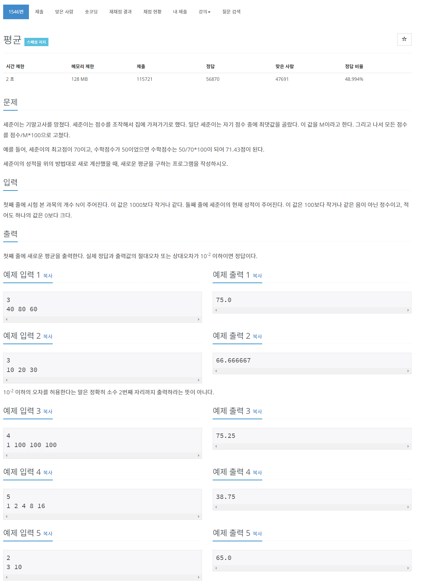

## 🤞 Comment

### 1) for of 문: 반복 가능한 객체(Array, map, set, string, typedArray, arguments 객체 등에 대해서 반복한다.
```javascript
for(value of iterable){};
```

- iterable : 반복되는 열거가능(enumerable)한 속성이 있는 객체