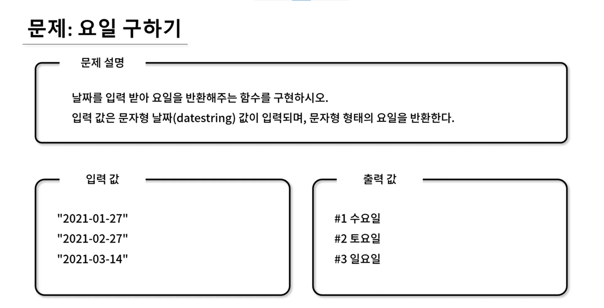

## 🤞 Comment

### 1) 날짜 정보 얻기 day: 0(sun) ~ 6 (sat)

```javascript
let date = new Date();
console.log(date.getDay()); 
```

## 🚨 주의 사항 🚨
hangulDay 배열 값을 얻기 위해 for문을 적었지만, for문 필요없이 해결이 가능하다!