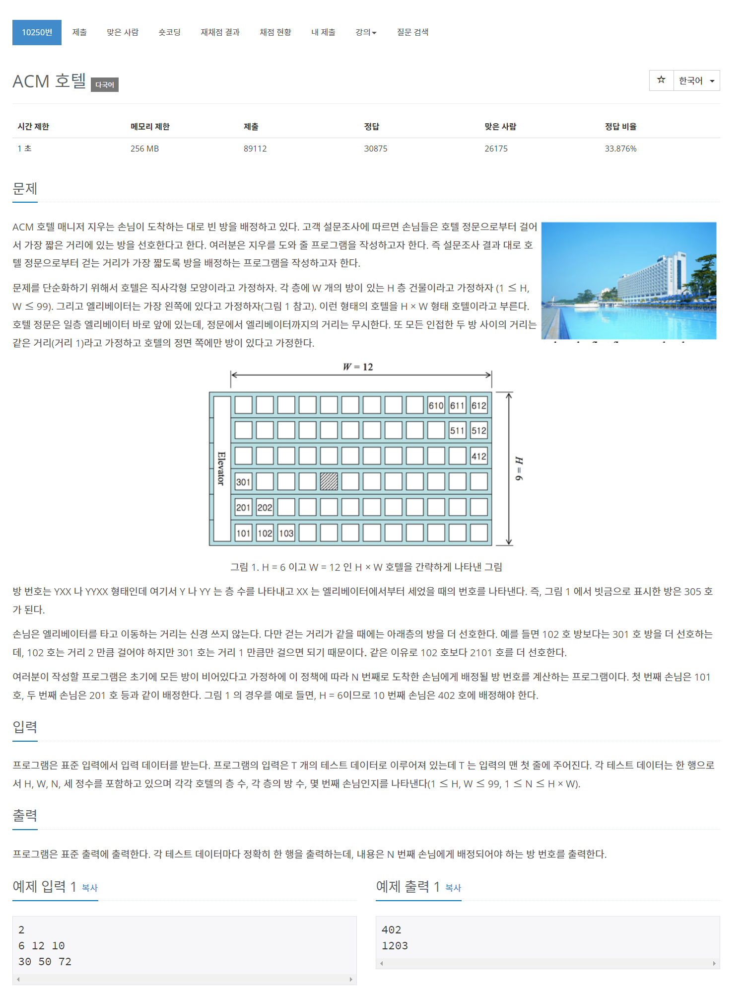

## 🤞 Comment
- 왼쪽에 위치한 정문과 가까운 순서대로 방배정이 됩니다.
- 예시) 101 → 201 → 301 → 401 → ..  → 102 → 202
- 방 호수는 '층+번째'로 작명되기 때문에 층과 번째를 따로 따로 구하는 게 포인트입니다.
- 인원의 층수는 꼭대기까지 가면 다음 수로 넘어갑니다. 그래서 `const floor = N % H;`
- 번째`roomLastNo`를 나타내는 호수는 첫번째 입력값을 전제로 1~6 : 1, 7~12 : 2이기 때문에 `N / H` 입니다.
  - 그러나 코드는 조금 복잡하게 되어 있습니다.
  - 예로 N = 6, H = 6일 때, 101 ~ 106까지 N / H를 하면 1 ~ 5의 몫은 0이고 6의 몫은 1이 되기 때문에 이를 맞춰 주기 위해서 (N-1)로 해서 `(N - 1) / H` 합니다.
  - 이때, 1호는 0, 2호는 1, 3호 2로 나오기 때문에 1을 더해주고 소수점은 버림해줍니다.
  - `const roomLastNo = Math.floor((N - 1) / H) + 1;`

