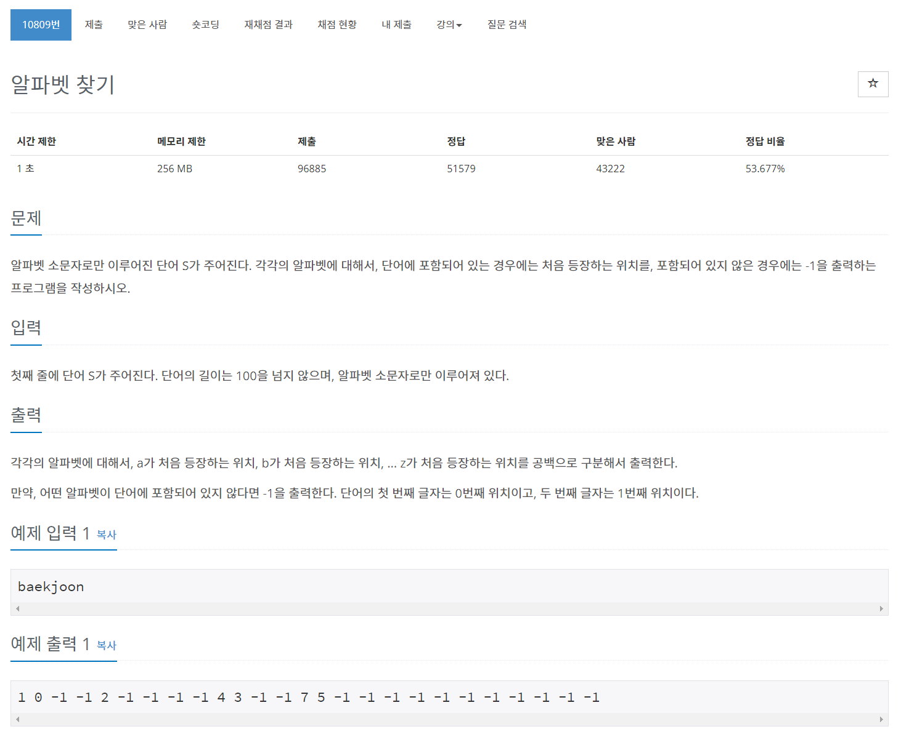

## 🤞 Comment
### 1) charCodeAt
문자열에서 지정된 인덱스에 있는 문자의 유니코드를 반환

```javascript
const str = "HELLO WORLD";
const n = str.charCodeAt(0); //72
```

### 2) fromCharCode
유니코드를 문자열로 변환

```javascript
const str = String.fromCharCode(104,101,108,108,111); //hello
```

### 3) Referrences
https://velog.io/@nsunny0908/TIL-13-javascript-%EC%95%84%EC%8A%A4%ED%82%A4%EC%BD%94%EB%93%9C-charCodeAt-fromCharCode