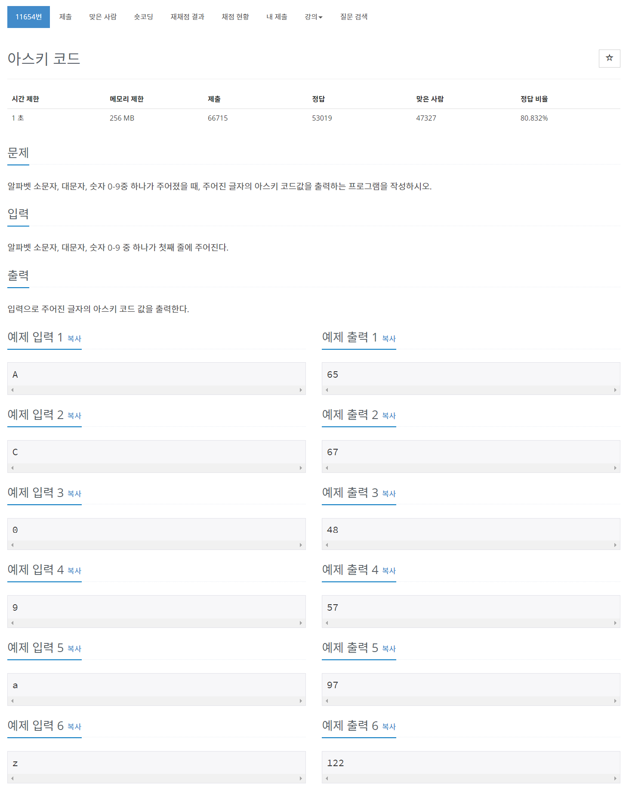
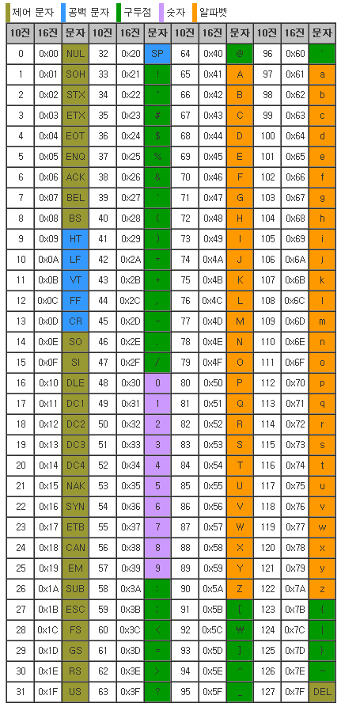

## 🤞 Comment

### 1) ASCII Code
charCodeAt(): 문자열 중 하나를 선택하여 아스키코드 번호로 반환해주는 함수
```javascript
'happy'.charCodeAt(2); // 112
```

fromCharCode(): 아스키 코드 번호를 받아 문자열을 구성해주는 함수
```javascript
String.fromCharCode(112); //p
```


