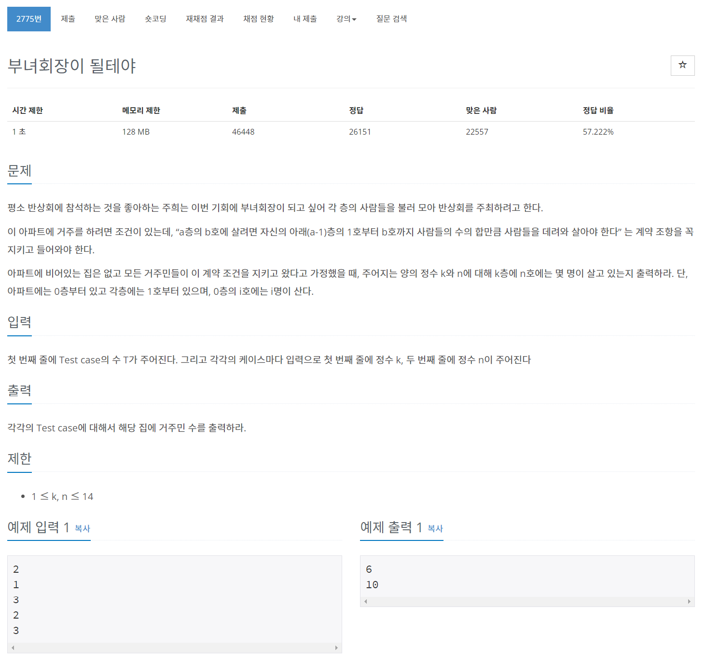
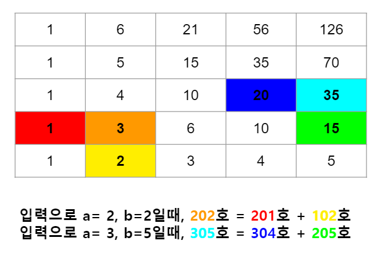

## 🤞 Comment
- “a층의 b호에 살려면 자신의 아래(a-1)층의 1호부터 b호까지 사람들의 수의 합만큼 사람들을 데려와 살아야 한다” 는 계약 조항이 있습니다. **[a행, b열]**
- 예를 들어 2층의 202호에 살려면 1층의 1호부터 2호까지(101호, 102호) 거주민 수의 합입니다.
- 또 다른 예로 3층의 305호에 살려면 2층의 1호부터 5호까지(201호, 202호, 203호, 204호, 205호) 거주민 수의 합 입니다. 
- b호를 구하기 위한 아이디어는 아래층 동일 호(1호 ~ b호)까지의 총합이 아니라 b-1호와 바로 아래층 동일 호의 값을 더해서 구할 수 있습니다.
- **b호 = (b-1)호 + 아래층 동일 호**

  

- **단, 아파트는 0층부터 시작하고 각층에는 1호부터 14호까지 있습니다.**

### References
https://www.youtube.com/watch?v=b8beK0fTeQs
https://dpsc615.tistory.com/98
