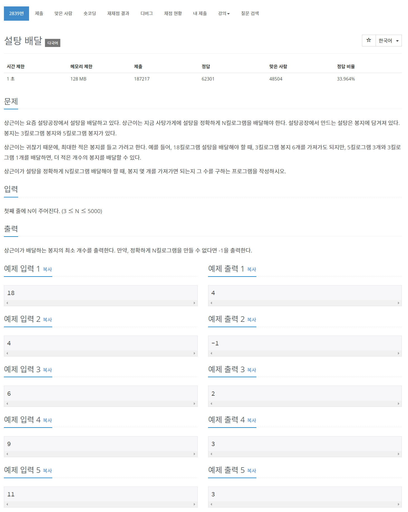

## Comment 🤞
- 최대한 적은 개수의 봉지를 배달하기 위해 5킬로그램 봉지(이하 `bongJi5`)를 많이 사용할 것 입니다.
- 입력 수가 `bongJi5` 가 5로 나누어 떨어지지 않으면 `bongJi5`를 뜯고 즉 이전 `bongJi5`에서 -3을 해줍니다. `bongJi3`로 대체된 것이라 `bongJi3`++를 해줍니다. 이 행위를 `bongJi5` 값이 5로 나눠 나머지가 0일 때 까지 합니다.
- 결과값은 `bongJi5` 개수 + `bongJi3` 개수 입니다.
- 