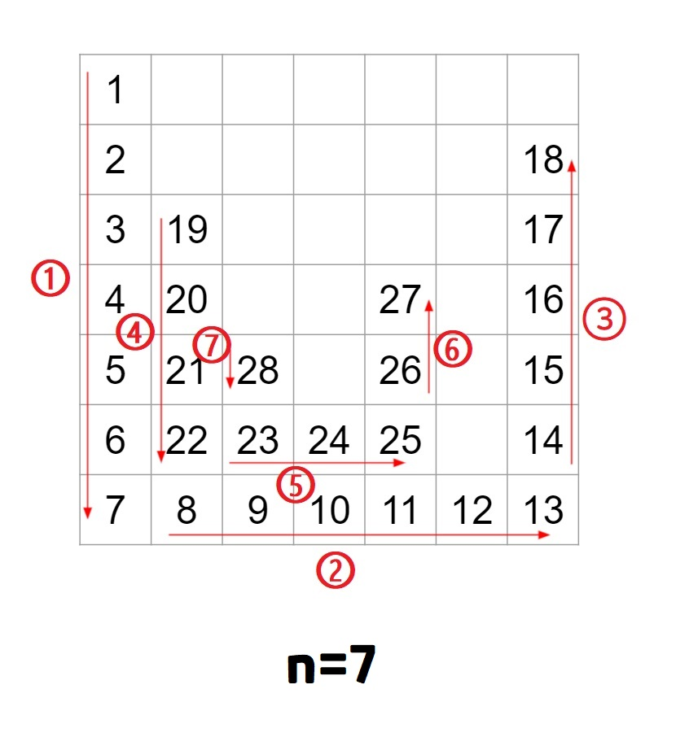

# 🐌삼각 달팽이🐌

문제 설명

정수 n이 매개변수로 주어집니다. 다음 그림과 같이 밑변의 길이와 높이가 n인 삼각형에서 맨 위 꼭짓점부터 반시계 방향으로 달팽이 채우기를 진행한 후, 첫 행부터 마지막 행까지 모두 순서대로 합친 새로운 배열을 return 하도록 solution 함수를 완성해주세요.

제한사항

- n은 1 이상 1,000 이하입니다.

입출력 예

|n|	result|
|---|---|
|4|	[1,2,9,3,10,8,4,5,6,7]|
|5|	[1,2,12,3,13,11,4,14,15,10,5,6,7,8,9]|
|6|	[1,2,15,3,16,14,4,17,21,13,5,18,19,20,12,6,7,8,9,10,11]|

## 🤞 Comment
### 사고 과정

0. r 변수 선언 후 r에 -1을 할당하여 위 그림 ①이 n만큼 length가 되게 해줍니다.
1. 2차원 빈 배열(result[])을 만들고 elements는 num 변수를 이용해 값을 1부터 MAX까지 저장하고 반환합니다.
2. 반복문 3개로 n(length)을 1씩 줄여가면서 '⊔' 모양을 만들어 줍니다.  
2-1. while을 한 번 돌때마다 '⊔' 모양이 나오게 됩니다.
3. newC 변수를 이용해 새로운 열(column) 값을 할당해줍니다. → 새 '⊔' 모양의 시작
4. 배열 길이가 0이되면 while문은 종료됩니다.
5. 빈 요소를 제거합니다.  
5-1. n=4 일때, while문이 종료된 배열  
  [ 
   &nbsp;&nbsp; [ 1 ], 
   &nbsp;&nbsp; [ 2, <2 empty items>, 9 ], 
   &nbsp;&nbsp; [ 3, 10, <1 empty item>, 8 ], 
   &nbsp;&nbsp; [ 4, 5, 6, 7 ] 
  ] 
5-2. join(',') 쉼표로 구분된 문자열로 만듭니다.  
5-3. split(',') 문자열을 쉼표 구분자로 잘라 배열 만듭니다.  
5-4. filter(item => item) 배열 내 빈 요소를 제거합니다.  
5-5. map(value => +value) 정수 값을 반환합니다. 

배열 좌표처럼 예를 들면 (2,2) 이런식으로 `result[r][c]` 를 초기값을 조절해서 맞춰주려 했는데, 그렇게 할 수 없음을 결론냈고 행 한칸, 열 한 칸 이렇게 한 칸씩 가는 용도로 r, c를 샤용해야 합니다. 

다음에 만날 달팽이는 더 빨리 풀 수 있기를 🙏
**우왕~ 3시간 걸렸다😭**