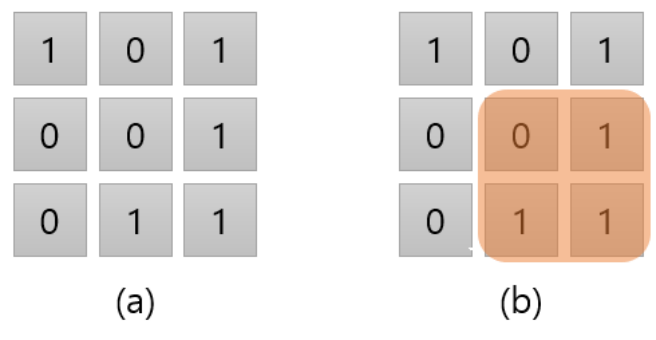

[문제 설명]

r * c 크기의 온실에 식물을 키우고 있습니다. 식물이 잘 자라도록 n * n만큼 커버가 가
능한 램프를 설치하려고 합니다.
r * c 크기의 field에 식물이 없는 경우 0으로, 식물이 있는 경우 1로 주어지고, 램프의
크기 n이 주어질 때, 최대한 커버 가능한 식물의 수를 구하는 함수, solution을 완성해
주세요.
예를 들어, 3 x 3 크기의 온실[[1, 0, 1], [0, 0, 1], [0, 1, 1]]가 그림 (a) 와 같이 주어지고
램프의 크기 2가 주어질 때, 최대한 커버 가능한 식물의 수는 그림 (b) 와 같이 3입니다.

[제한 사항]

- 주어진 식물은 옮겨 심을 수 없습니다.

[입력 형식]

- 온실의 식물 정보 field가 주어집니다.
- field는 0과 1로 이루어진 r x c 크기의 2차원 배열입니다.
- 온실의 크기 r과 c는 1 이상 100 이하의 자연수입니다.
- 램프의 크기 n이 주어집니다.
- n은 1 이상 r과 c 이하의 자연수입니다.

[출력 형식]

램프로 최대한 커버 가능한 식물의 수를 출력합니다
