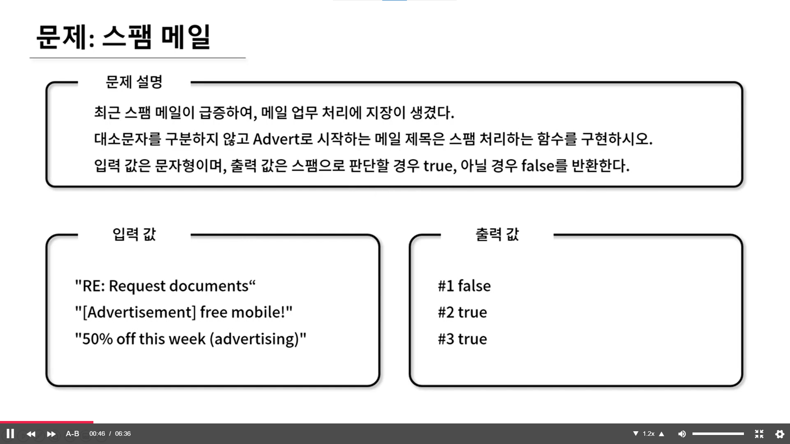

## 🤞 Comment

### 1) includes() 함수
특정 문자열을 확인 함수입니다.

```javascript
string.includes(searchString, length)
```

- searchString : 검색할 문자열로 대소문자를 구분합니다.
- length : 검색을 시작할 위치입니다. (Optional)
반환 타입은 불리언입니다.