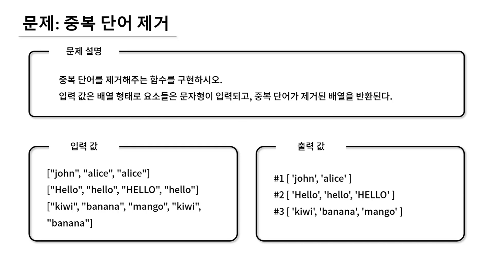

## 🤞 Comment

### 1) filter() 함수
특정 조건에 부합하는 배열의 **모든 값을 배열 형태**로 리턴합니다. 

```javascript
array.filter(callback(element, index, array))
```

- element: 현재 처리 중인 배열의 element
- index: 현재 처리 중인 배열의 idnex. (Optional)
- array: filter()가 호출된 배열입니다. (Optional)


### 2) indexOf() 함수
배열 안에서 찾으려는 값(searchElement)과 정확하게 일치(===)하는 **첫번째** element의 index를 반환합니다. 찾는 값이 존재하지 않으면 -1을 반환합니다. 

```javascript
array.indexOf(searchElement, fromIndex);
```

- searchElement: 찾는 값
- fromIndex: 검색을 시작할 index (Optional)

### 3) 참고 블로그
https://hianna.tistory.com/422
https://hianna.tistory.com/404
https://hianna.tistory.com/406


