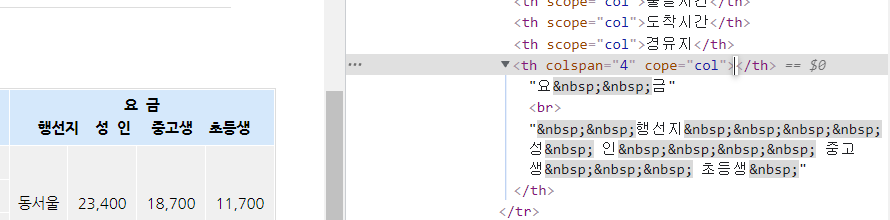
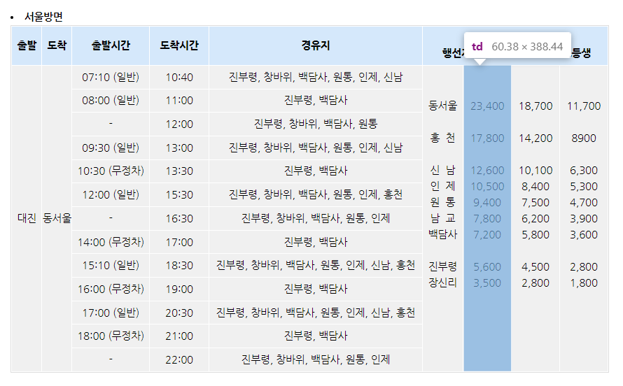
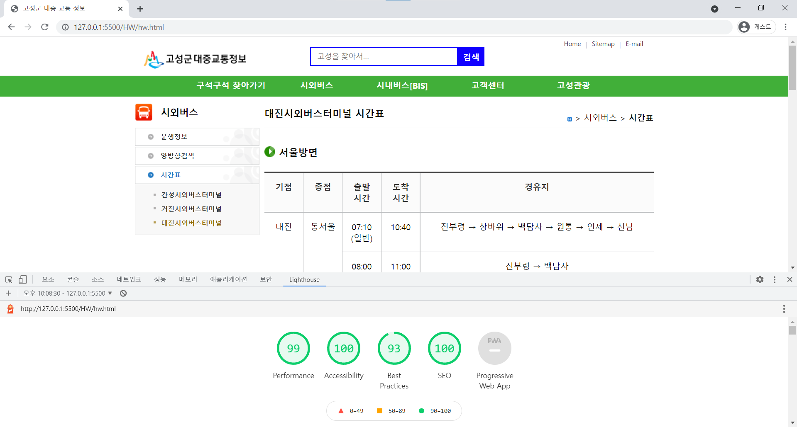

# HTML/CSS 개인과제

## 0. 프로젝트 후기

"표는 이해하기 쉽게 구성하는가?" 질문에 입각하여 접근성이 좋지 않은 웹 페이지를 [고성군 대중교통정보 대진시외버스터미널 시간표](https://www.goseong-pti.com/index.php?mp=p3_3_3) 로 선정했습니다. 

  ① 요금 `<th>` 영역은 하나의 row지만 `<br>`과 &nbsp; 강제 spacing으로 두 행으로 보이게 만듦
  


  ② 표 내용을 이해하기 어려움
  

사용자의 이해를 돕기 위해 하나의 테이블을 두 개로 나눴고 테이블 제목에 이미지를 넣어 운용의 용이성을 향상시켰습니다. 

얕게 공부했을 당시는 웹 표준과 웹 접근성을 동일시 생각하여 표준에 맞춰 웹 제작하면 된다고 생각했었습니다. 그러나, 웹 콘텐츠 접근성 지침(WCAG 2.1)은 단지 **'최소한'의 가이드 라인**이며 웹 접근성은 해당 사이트를 이용하는 모든 이들에 대한 개발자의 **배려** 입니다. 웹 접근성을 향상시키기 위해 개발자의 **고심**이 접근성을 높이는 최선의 방법이라고 생각합니다. 

해당 과제를 통해 윈도우 환경에서도 사회적 약자에게 제공되는 '접근성 키보드 설정' 기능을 알게되었는데, 제로 베이스 자바스크립트 동영상의 소스 코드가 너무 작아 담당자 분께 말씀드렸었는데, Windows의 돋보기 기능을 알고 난 후로 이 기능을 이용해서 강의를 청취하고 있습니다. 

일상생활에서도 보도 블럭과 신호등 안내음성의 부재 등 지켜지지 않는 경우를 발견합니다. 그러나 우리 웹 프론트엔드 개발자들이 웹 표준을 준수하기 위해 노력하는 만큼 웹 접근성의 지침이 기본이 준수되는 세상이 오리라 믿습니다.


## 1. Check List
|항목|준수 여부| 미준수 원인|
|---|:---:|:---:|
|의미가 있는 이미지에 적절한 대체 텍스트를 제공하고 있는가?|⭕|| 
|배경 이미지가 정보를 포함하고 있는 경우 적절한 대체 정보를 제공하고 있는가?|⭕|| 
|멀티미디어 콘텐츠에 동기화된 자막이나 원고를 제공하고 있는가?|⭕|| 
|색상만으로 정보를 이해할 수 있게 제공하고 있지는 않은가?|⭕|| 
|배경 색상과 전경 색상의 명도 대비 4.5:1을 준수하고 있는가?|⭕||
|마우스로 이용할 수 있는 기능이 키보드로도 이용이 가능한가?|⭕|| 
|키보드 접근 순서가 논리적이고 초점을 구분할 수 있는가?|⭕|| 
|콘텐츠의 반복되는 영역을 건너뛰어 본문의 핵심 영역으로 이동할 수 있는 수단을 제공하고 있는가?|⭕|| 
|페이지 제목은 적절하게 제공되고 있는가?|⭕|| 
|프레임 제목을 title 속성을 사용하여 적절하게 제공하고 있는가?|⭕|| 
|콘텐츠 블록에 `<h1>`~`<h6>`까지 적절한 제목을 제공하고 있는가?|⭕|| 
|링크 텍스트는 용도나 목적을 이해할 수 있도록 제공하고 있는가?|⭕|| 
|기본 언어를 명시하고 있는가?|⭕|| 
|사용자가 의도하지 않은 기능(초점 변화, 서식 전송, 새 창, 팝업, 레이어)이 제공되고 있지는 않은가?|🔺|`<a>` 링크 새창은 title 속성으로 명시| 
|콘텐츠를 논리적인 순서로 제공하고 있는가?|🔺| 논리적인 접근 순서에 따른 콘텐츠 배치를 지향 | 
|표에 `〈caption>` 요소를 통한 제목과 요약 정보를 제공하고 있는가?|⭕|| 
|표에 제목 셀과 내용 셀을 구분하여 적절하게 제공하고 있는가?
(제목 셀은 `<th>` 요소를 사용해야 하며 해당 제목이 열 제목인지행 제목인지 구분할 수 있도록 scope 속성을 함께 제공해야 함)|⭕||  
|입력 서식이 가지는 id 값을 해당 서식과 연관이 있는 `<lable>` 요소의 for 속성에 지정하여 제공하고 있는가?|⭕||
|마크업 요소의 열고 닫음, 중첩 관계 및 속성 선언에 오류가 없는가?|⭕||
|표는 이해하기 쉽게 구성하는가?|⭕||

## 2. KWCAG 2.1 기반 웹 접근성 평가

### 대체 텍스트
🧩 **수정 전**
```javascript

```


🧫 **수정 후**
```javascript

```
이미지를 대체하는 텍스트 제공

### 건너뛰기 링크
🧩 **수정 전**
```javascript
<a href="#content" class="skip">본문 바로가기</a>
```


🧫 **수정 후**
```javascript
<a href="#content" class="skip">본문 바로가기</a>
<a herf="#gnb" class="skip">메인메뉴 바로가기</a>
```
건너뛰기 링크 추가로 키보드 접근성 고양


### 레이블 수정
🧩 **수정 전**
```javascript
<input type="submit" value="검색" class="ok">
```


🧫 **수정 후**
```javascript
<label for="mainSrchOk">검색 버튼</label>
<input type="submit" value="검색" id="mainSrchOk" class="ok">
```
`<label>` 추가


### 명도 대비 
🧩 **수정 전**
```css
#header .srch .kwd input {
  border: 2px solid #41AF39;
}

#header .srch .ok {
  background-color: #41AF39;
  border: 2px solid #41AF39;
}
```

🧫 **수정 후**

```css

#header .srch .kwd input {
  border: 2px solid #1100ff;
}

#header .srch .ok {
  background-color: #1100ff;
  border: 2px solid #1100ff;
}
```


## 3. HTML/CSS 유효성 검사

### 표 콘텐츠
🧩 **수정 전**
```javascript
<table class="tbl_type" cellspacing="1" cellpadding="0" summary="서울방면 시간 및 요금에 대한 내용입니다">
```


🧫 **수정 후**
```javascript
<table class="tbl_type" summary="시외버스 터미널 버스 시간표입니다. 기점, 종점, 출발 시간, 도착시간, 경유지 순으로 내용을 담고 있습니다.">
<caption>시외버스 터미널 버스 시간표입니다.</caption>
```


### 인코딩
🧩 **수정 전**
```javascript
<meta http-equiv="Content-Type" content="text/html; charset=euc-kr">

```

🧫 **수정 후**
```javascript
<meta http-equiv="Content-Type" content="text/html; charset=utf-8">

```


### col attribute
🧩 **수정 전**
```javascript
<colgroup>
  <col width="5%">
  <col width="5%">
  <col width="13%">
  <col width="10%">
  <col width="36%">
</colgroup>
```


🧫 **수정 후**
```javascript
<colgroup>
  <col style="width:10%">
  <col style="width:10%">
  <col style="width:10%">
  <col style="width:10%">
  <col style="width:auto;">
</colgroup>
```
style attribute로 대체


## 4. Lighthouse 검사

### Document does not have a meta description
🧩 **수정 전**
```javascript
해당 코드 없음
```


🧫 **수정 후**
```javascript
    <meta name="author" content="고성군">
    <meta name="keywords" content="고성군,창녕여행, 교통/지도, 교통안내, 시외버스">
    <meta name="description" content="고성군,창녕여행, 교통/지도, 교통안내, 시외버스">
    <meta property="og:title" content="시외버스">
    <meta property="og:site_name" content="고성군대중교통정보">
    <meta property="og:type" content="website">
    <meta property="og:image" content="./image/logo.gif">
    <meta property="og:description" content="고성군, 고성여행, 교통/지도, 교통안내, 시외버스">
```

### Links to cross-origin destinations are unsafe
🧩 **수정 전**
```javascript
<a href="https://www.gwgs.go.kr/tour/index.do" target="_blank" title="새창">고성관광</a>
```


🧫 **수정 후**
```javascript
<a href="https://www.gwgs.go.kr/tour/" target="_blank" rel="noopener noreferrer" title="새창">고성관광</a>
```

### Background and foreground colors do not have a sufficient contrast ratio
🧩 **수정 전**
```css
#footer p em {font-style:normal; color:#06F;}
```


🧫 **수정 후**
```css
#footer p em {font-style:normal; color:#1100ff;}
```


## 5. 접근성 및 SEO 관련 분석 리포트



