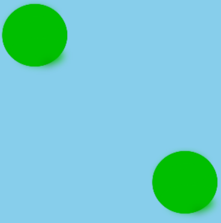
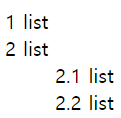

## 1. class="check"로 되어 있는 모든 `<input="checkbox">` 요소의 스타일을 선택하는 Selector

**정답:** input[type="checkbox"].check


## 2. `<a>` 태그 밑줄 제거 style 인라인 태그 
**정답:** style="text-decoration:none"


## 3. 그림과 같이 오른쪽 하단으로 보내기


**🧸 문제 코드**
```html
<head>
  <style>
  .flex {
    width: 300px; 
    height: 300px;
    display: flex;
    justify-content: space-between;
    background: skyblue;
  }

  /* 답 CSS */

  </style>
</head>
<body>
  <div class="flex">
    <span>
    
    </span>
    <div>
    
    </div>
    </div>
</body>
```

**정답:** div:nth-child(2) { align-self : flex-end; }


**👔 해설**


오른쪽 원 하나만 교차축의 끝점을 기준으로 배치합니다.

## 4. 그림과 같이 자동으로 번호 매기기



**🧸 문제 코드**
```html
<head>
  <style>
    ol { 
      counter-reset: list; 
      list-style-type: none; 
    } 

    li::before { 
      content: [A] (list, '.') ' '; 
      [B]: list; 
    }
  </style>
</head>
<body>
  <ol>
    <li>list</li>
    <li>list</li>
    <ol>
      <li>list</li>
      <li>list</li>
    </ol> 
  </ol>
</body>
```


**👔 해설**


오른쪽 원 하나만 교차축의 끝점을 기준으로 배치합니다.


