# 정렬(Sorting)
배열 내 원소들을 번호순이나 사전 순서와 같이 **일정한 순서대로** 열거하는 알고리즘
- O(n^2): 거품정렬, 선택정렬, 삽입 정렬
- O(nlogn): 병합 정렬, 퀵 정렬

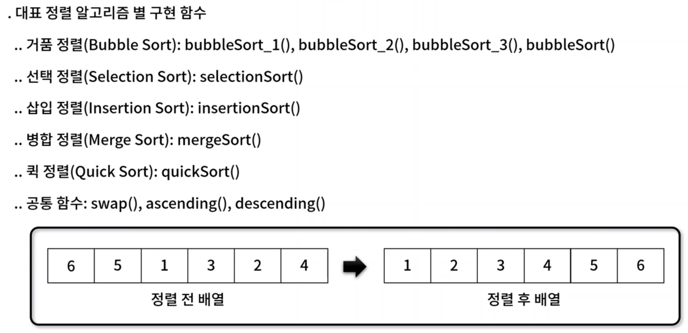


## 1. 거품 정렬(Bubble Sort)
- 서로 **인접한** 두 원소를 비교하면서 정렬하는 알고리즘
- 평균 시간 복잡도: O(n^2)
- 알고리즘 동작 방식

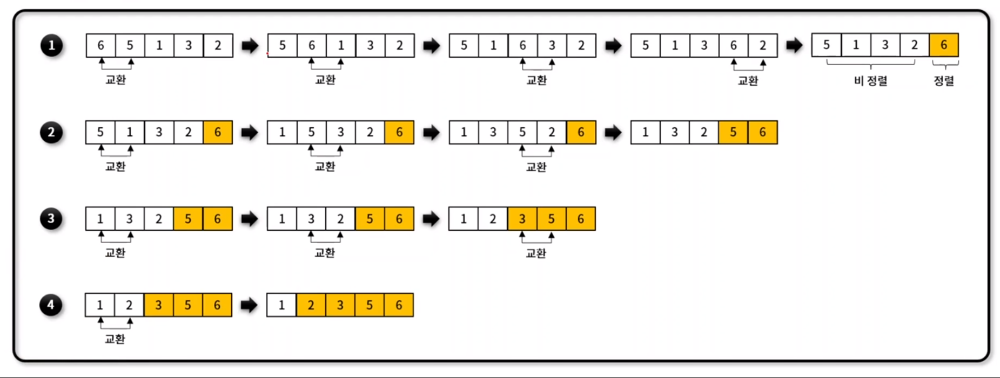


### 거품 정렬 구현 (1)
✨ **예시**

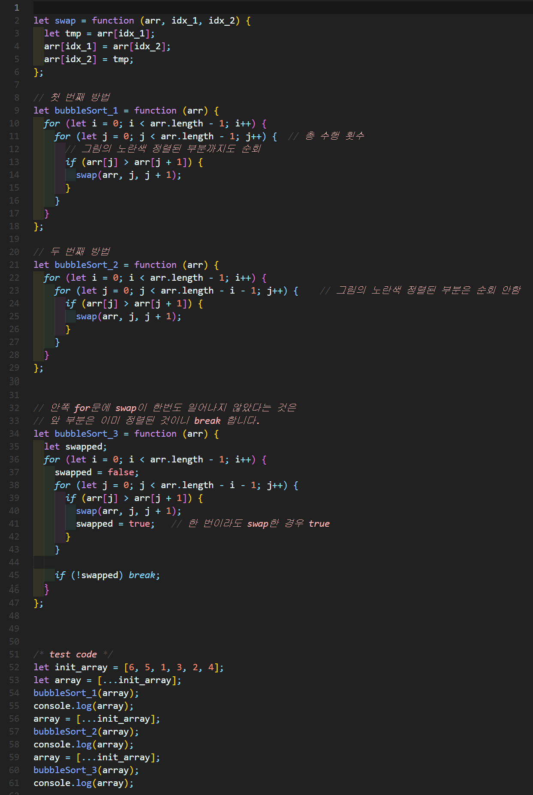


🧪 **실행결과**

```javascript
[ 1, 2, 3, 4, 5, 6 ]
[ 1, 2, 3, 4, 5, 6 ]
[ 1, 2, 3, 4, 5, 6 ]
```

### 거품 정렬 구현 (2)


✨ **예시**

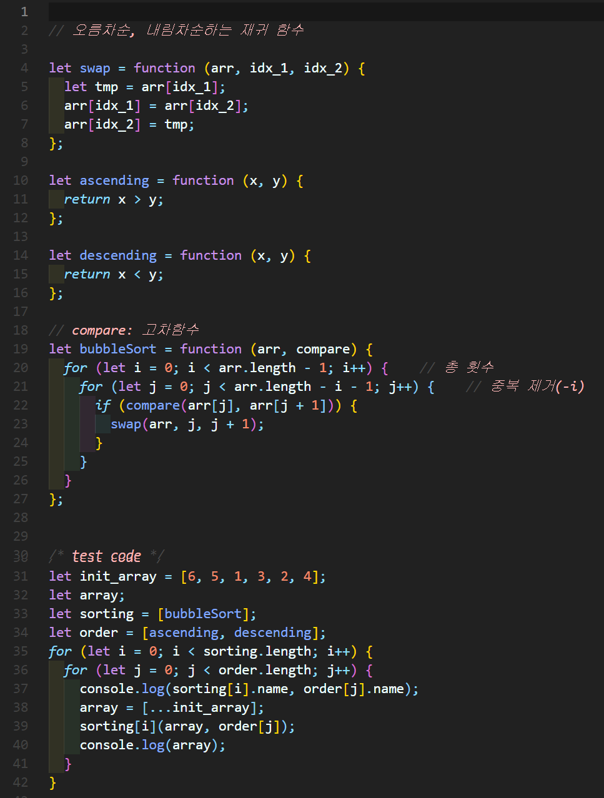


🧪 **실행결과**

```javascript
bubbleSort ascending
[ 1, 2, 3, 4, 5, 6 ]
bubbleSort descending
[ 6, 5, 4, 3, 2, 1 ]
```


## 2. 선택 정렬(Selection Sort)
-  **최솟값을 찾아** 데이터 영역의 가장 앞으로 이동하는 방식을 반복하여 전체 데이터 영역을 정렬하는 알고리즘
- 평균 시간 복잡도: O(n^2)

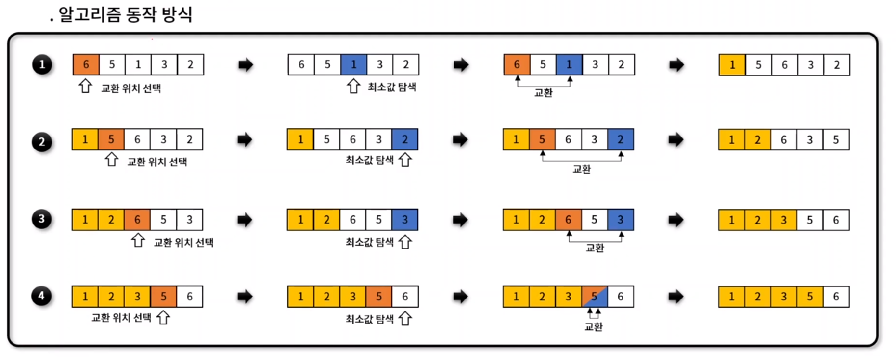

✨ **예시**

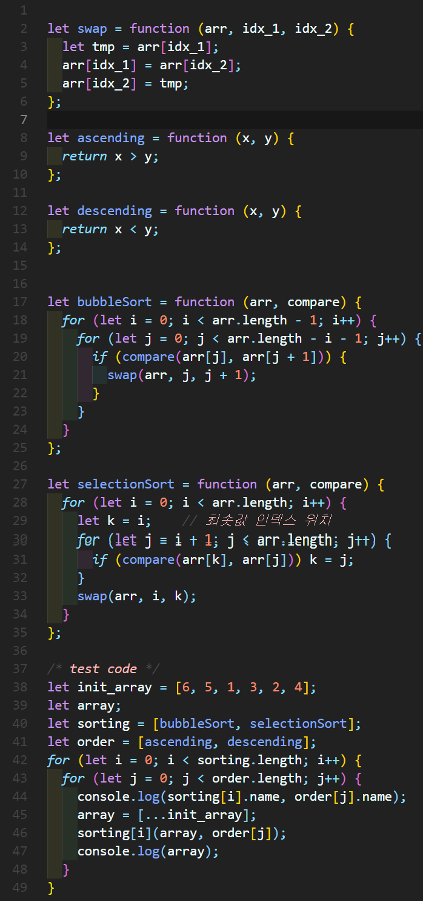


🧪 **실행결과**

```javascript
bubbleSort ascending
[ 1, 2, 3, 4, 5, 6 ]
bubbleSort descending
[ 6, 5, 4, 3, 2, 1 ]
selectionSort ascending
[ 1, 2, 3, 4, 5, 6 ]
selectionSort descending
[ 6, 5, 4, 3, 2, 1 ]
```


## 3. 삽입 정렬(Insertion Sort)
-  이미 정렬된 데이터 영역과 비교하면서, **자신의 위치를 찾아 요소를 삽입**하여 정렬하는 알고리즘 
- 평균 시간 복잡도: O(n^2)

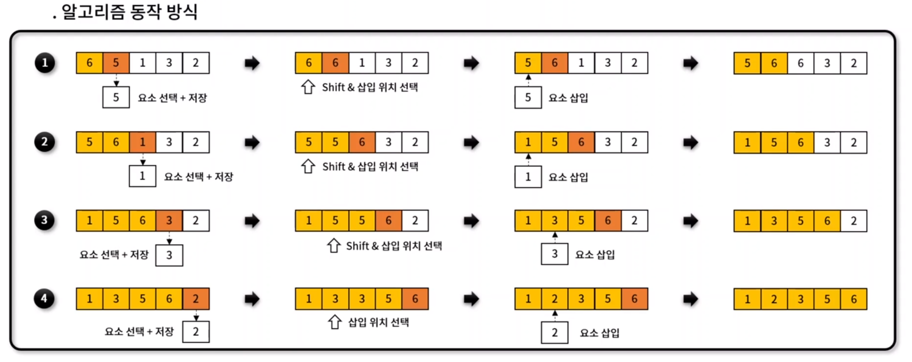


✨ **예시**


## 4. 병합 정렬(Merge Sort)
- 하나의 배열을 두 개의 균등한 **크기로 분할하고, 부분 정렬하며, 이를 다시 합하면서 전체를 정렬**해가는 알고리즘
- 평균 시간 복잡도: O(nlogn)

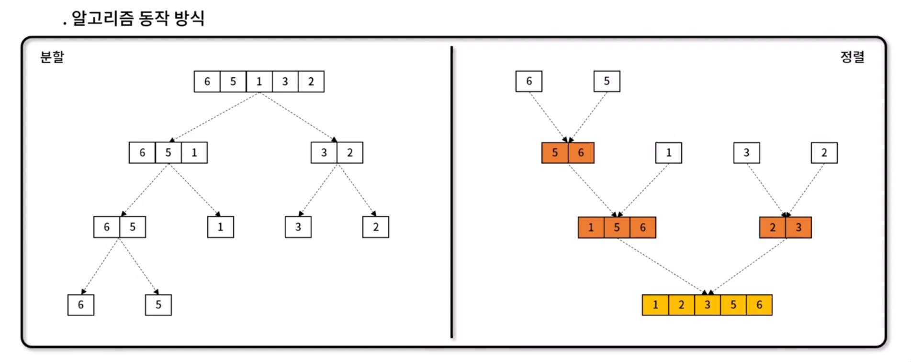


✨ **예시**

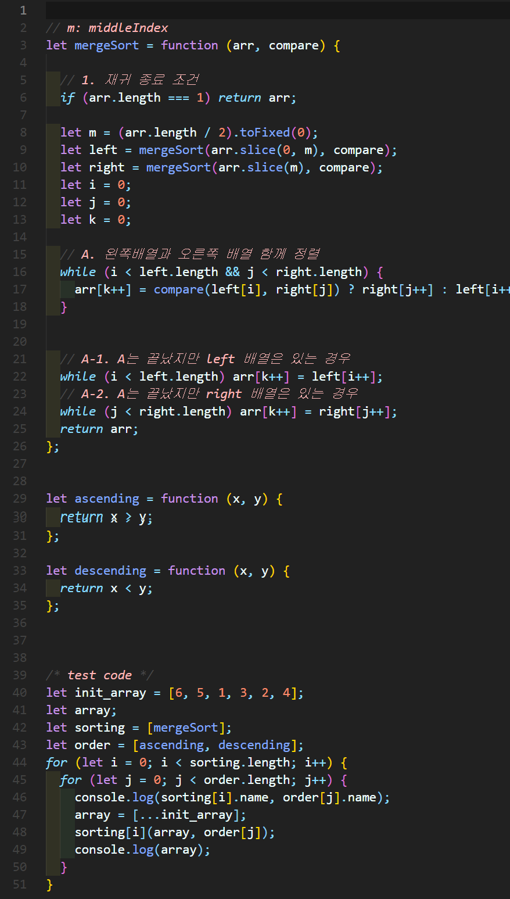


## 5. 퀵 정렬(Quick Sort)
- **특정한 값(pivot)을 기준**으로 큰 숫자와 작은 숫자를 **분할**하여 정렬하는 알고리즘 
- 평균 시간 복잡도: O(nlogn)

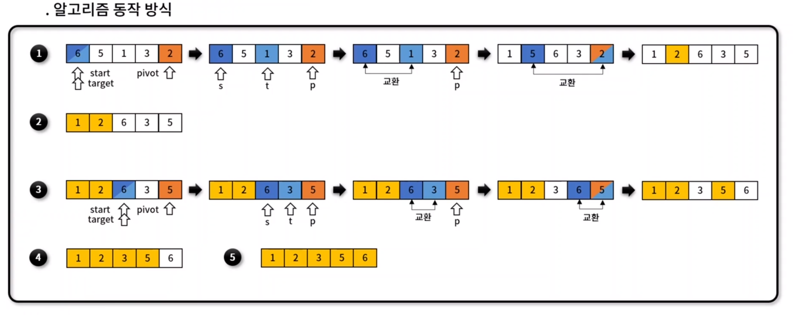

✨ **예시**

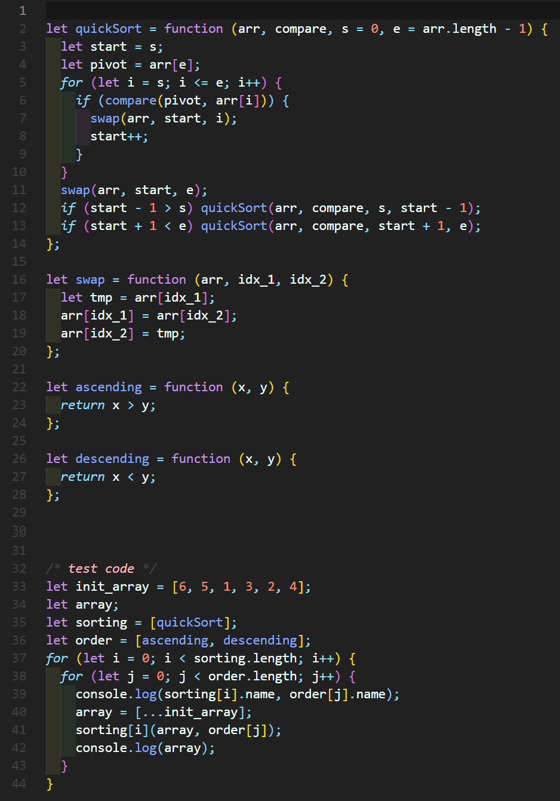
