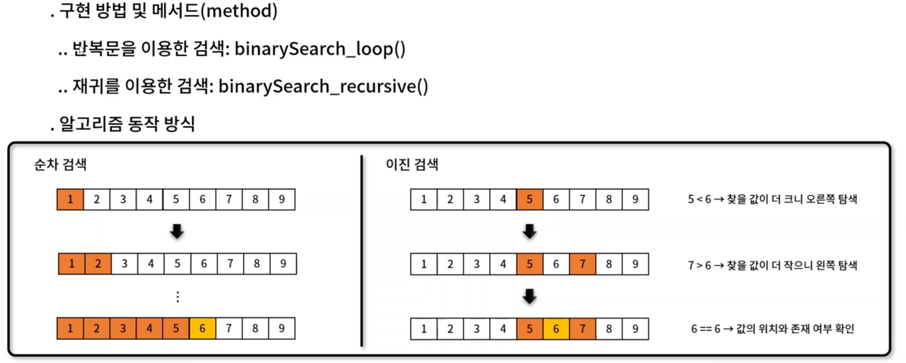
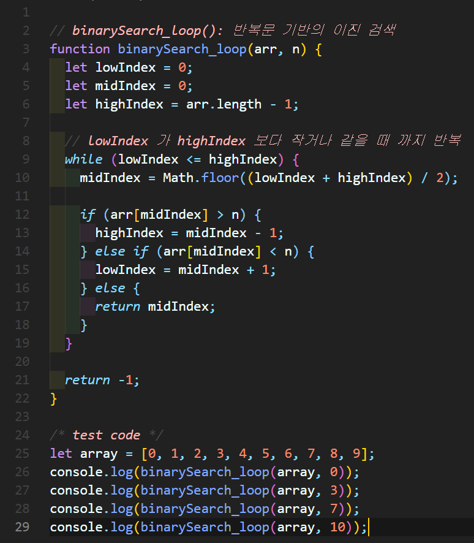
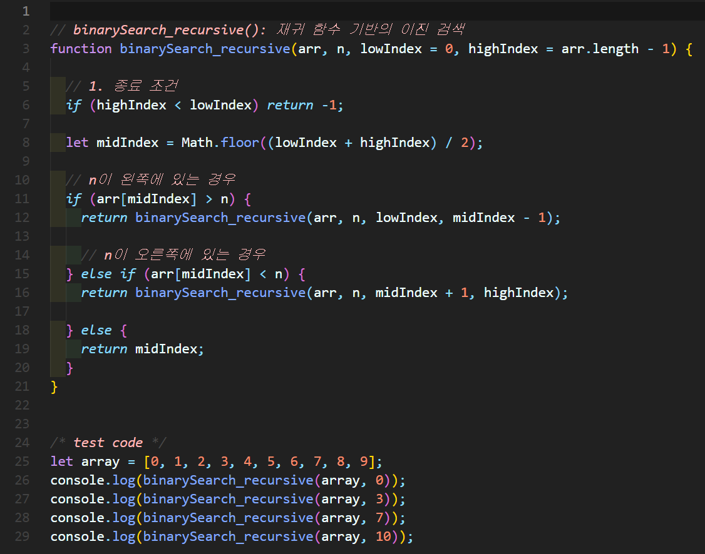

# 이진검색(Binary Search)
- 자료 구조 기반으로 **정렬되어** 있는 데이터 안에서 **특정 값**을 찾는 기법
- 원하는 값을 효율적으로 검색하는 방법에서 착안된 기법입니다.
- 평균 시간 복잡도 : O(logn)
  - 순차 검색 평균 시간 복잡도: O(n)



  - 찾는 값: 6
  - 순차 검색: for문 안에 if문으로 6을 찾습니다.
  - 이진 검색: 배열의 가운데 값을 찾고 기준으로 왼쪽, 오른쪽을 파악하는 방식을 재귀로 탐색 예시) 병뚜껑 숫자 게임


### 이진 검색 구현 (1)
✨ **예시**




🧪 **실행결과**

```javascript
0
3
7
-1
```


### 이진 검색 구현 (2)
✨ **예시**




🧪 **실행결과**

```javascript
0
3
7
-1
```


