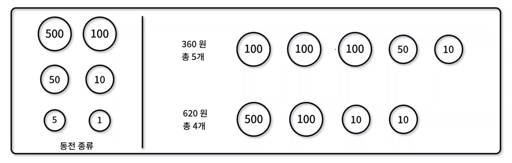

# 탐욕 알고리즘(Greedy Algorithm)
- **매 순간 최적 해를 선택**하면서 최종적으로 최적해에 도달하는 알고리즘 설계 기법
- 탐욕 알고리즘 특징
  - 최적 부분 구조나 탐욕 선택 속성 문제를 해결하는데 적합
  - 매 순간 최적 해를 찾으면서 구하는 방법이 항상 최적임을 보장하지 않아 유의 필요
- 예시) 동전 비교 설명
- 문제) b5585 거스름돈, p42862 체육복



###  [거스름돈 구현](https://www.acmicpc.net/problem/5585)

✨ **풀이**


🧪 **실행결과**

```javascript

```


###  [체육복 구현](https://programmers.co.kr/learn/courses/30/lessons/42862)

✨ **풀이**


🧪 **실행결과**

```javascript

```

