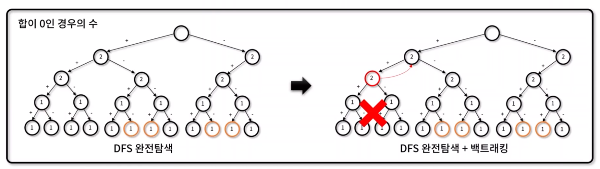

# 백트래킹 (Backtracking)
- 경우의 수로 해를 찾는 도중 **해가 나올 수 없는 조건일 때 이를 중단하고** 다른 경우의 수로 해를 찾는 알고리즘 기법 - 속도가 빠름

- 특징
  - 해가 될 가능성이 있으면 지속적 탐색, 가능성이 없다면 가지치기(pruning)하여 빠르게 전체 해를 탐색
  - 해가 되지 않는 경우의 수는 **배재**하여 해를 찾는 **시간 복잡도를 단축**


- 해가 되는 경우 주황색


###  [타겟 넘버 구현](https://programmers.co.kr/learn/courses/30/lessons/43165)
기존에는 **DFS 완전탐색**으로 풀었지만, **백트래킹**을 적용해 풀어봅니다.

✨ **풀이**


🧪 **실행결과**

```javascript

```