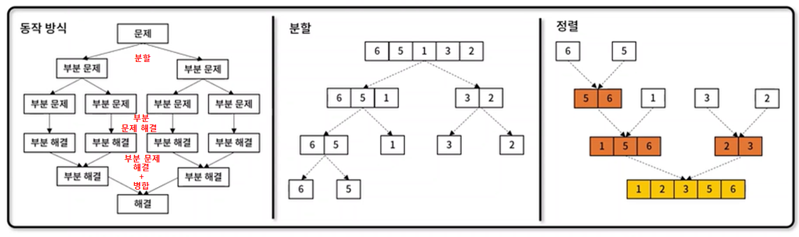

# 분할 정복 (Divide and Conquer)
- 문제를 나눌 수 없을 때까지 **작게 나누고, 부분 문제를 해결하여 병합**해 해를 도출하는 알고리즘 설계 기법
- 특징
  - 하향식 접근법으로 상위 해답을 구하기 위해 아래로 내려가면서 답을 도출
  - **분할한 부분 문제가 서로 중복되지 않아**, 부문 해 해결시 상호 영향 없음



  
###  [별 찍기 10 구현](https://www.acmicpc.net/problem/2447)

✨ **풀이**

``` javascript
/* user code - dfs + backtracking */
function dfs(numbers, target, sums, index, total) {
if (index === numbers.length) {
return target === total ? 1 : 0;
}
if (target > total && target > total + sums[index] ||
target < total && target < total - sums[index])
return 0;
let count = 0;
count += dfs(numbers, target, sums, index + 1, total + numb
ers[index]);
count += dfs(numbers, target, sums, index + 1, total -
numbers[index]);
return count;
}
function solution(numbers, target) {
let sums = new Array(numbers.length);
let sum = 0;
for (let i = numbers.length - 1; i >= 0; i--){
sum += numbers[i];
sums[i] = sum;
}
return dfs(numbers, target, sums, 0, 0);
}

```

🧪 **실행결과**

```javascript

```