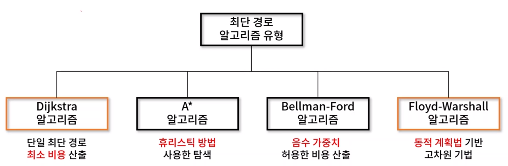
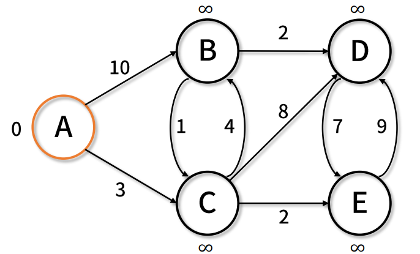

# 최단 경로 (Shortest Path)
- 가중 그래프에서 구성하는 간선 간 **가중치 합이 최소가 되도록 최단 경로**를 찾는 알고리즘
- 최단 경로 알고리즘 유형




## 1. Dijkstra 알고리즘
- 그래프에서 **출발점과 도착점 사이의 최단 거리**를 구하는 알고리즘
- 보통 단일 정점 간 최단 경로 산출 시 사용, 도로 교통망이나 OSPF 등의 네트워크 라우팅 프로토콜에 널리 이용


✨ **의사 코드**

```javascript
function Dijkstra(Graph, source):
    create vertex set Q
    for each vertex v in Graph:       // 초기화
        dist[v] ← INFINITY            // 소스에서 v까지의 아직 모르는 길이
        add v to Q                    // 모든 노드는 초기에 Q에 속해있다 (미방문 집합)

    dist[source] ← 0                  // 소스에서 소스까지의 길이

    while Q is not empty:
        u ← vertex in Q with min dist[u] // 최소 거리를 갖는 정점을 가장 먼저 선택한다

        remove u from Q
        for each neighbor v of u:     // v는 여전히 Q에 있다.
            alt ← dist[u] + length(u, v)
            if alt < dist[v]:         // v 까지의 더 짧은 경로를 찾았을 때
                dist[v] ← alt

    return dist[]
```


🧪 **그래프**




