# 트리(Tree)
- 그래프의 일종으로 **두 노드 사이의 하나의 간선만 연결**되어 있는 **최소 연결과 계층 형태**의 비선형 자료 구조
- 트리의 구조 및 용어

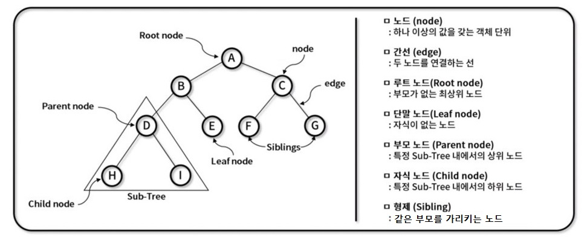


## 트리 특징
- 주요 특징: '최소 연결 트리'로 불림, 계층 모델, 방향 비순환 그래프(DAG: Directed Acyclic Graph) 한 종류
- 트리 종류: 이진 트리, 이진 탐색 트리, AVL 트리, 힙(Heap)

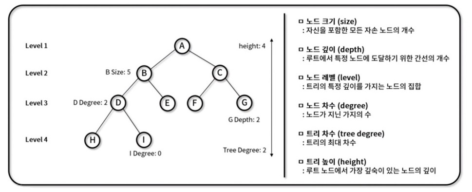


## 트리 순회
- 트리 구조에서 각각의 **노드를 정확히 한 번씩** 체계적인 방법으로 **방문**하는 과정


### [1) 전위 순회(Pre-order)](https://github.com/canmarkme/Today-ILearned/blob/main/%EC%9E%90%EB%A3%8C%EA%B5%AC%EC%A1%B0/%EB%B9%84%EC%84%A0%ED%98%95%20%EC%9E%90%EB%A3%8C%EA%B5%AC%EC%A1%B0/Tree/Tree_1.js)
- 내림 / 올림이 **스택**과 동일. 스택은 **재귀**와 동일합니다.

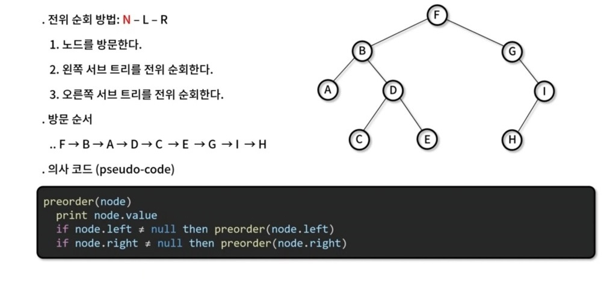
node == 현재 node


✨ **예시**

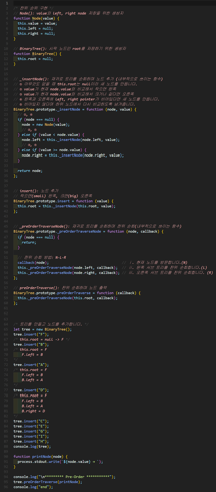


🧪 **실행결과**

```javascript
BinaryTree {
  root: Node {
    value: 'F',
    left: Node { value: 'B', left: [Node], right: [Node] },
    right: Node { value: 'G', left: null, right: [Node] }
  }
}

********* Pre-Order ***********
F → B → A → D → C → E → G → I → H → end
```


### [2) 중위 순회(In-order)](https://github.com/canmarkme/Today-ILearned/blob/main/%EC%9E%90%EB%A3%8C%EA%B5%AC%EC%A1%B0/%EB%B9%84%EC%84%A0%ED%98%95%20%EC%9E%90%EB%A3%8C%EA%B5%AC%EC%A1%B0/Tree/Tree_2.js)

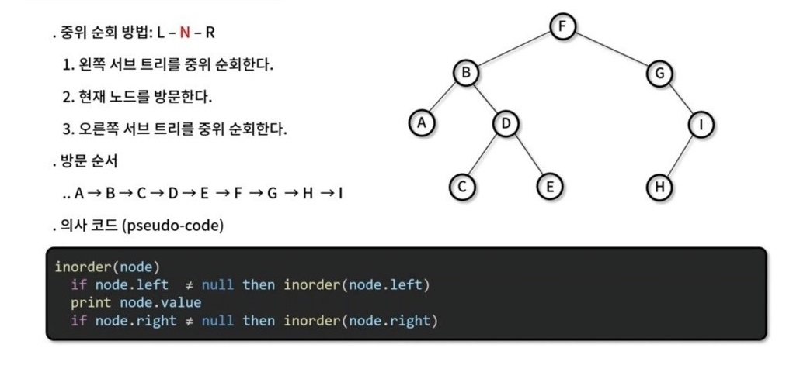


✨ **예시**

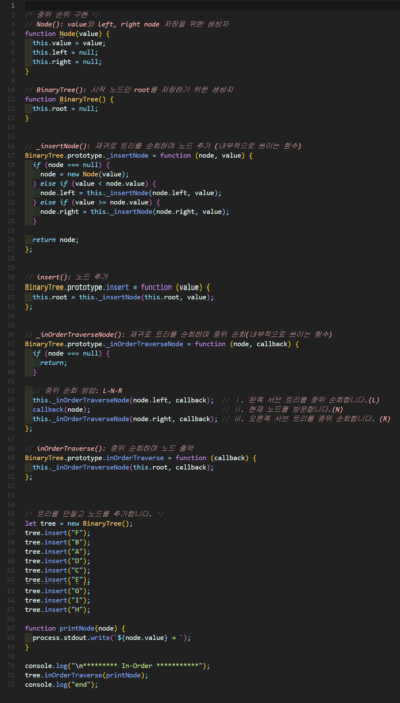


🧪 **실행결과**

```javascript

********* In-Order ***********
A → B → C → D → E → F → G → H → I → end
```


### [3) 후위 순회(Post-order)](https://github.com/canmarkme/Today-ILearned/blob/main/%EC%9E%90%EB%A3%8C%EA%B5%AC%EC%A1%B0/%EB%B9%84%EC%84%A0%ED%98%95%20%EC%9E%90%EB%A3%8C%EA%B5%AC%EC%A1%B0/Tree/Tree_3.js)

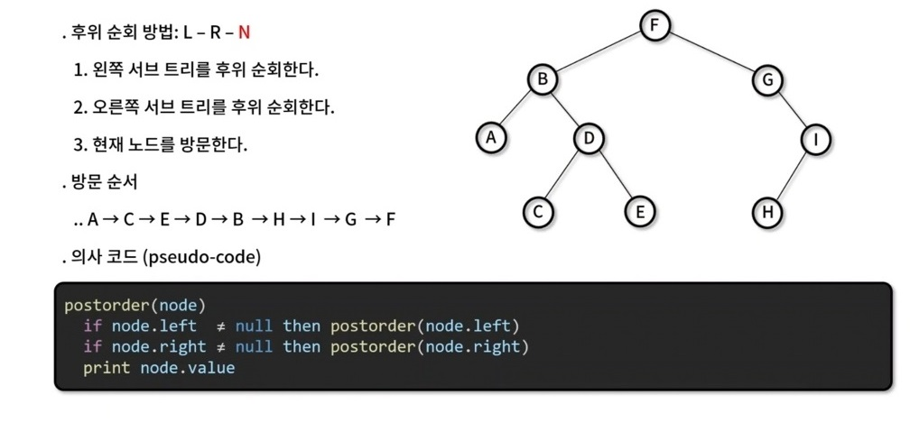


✨ **예시**

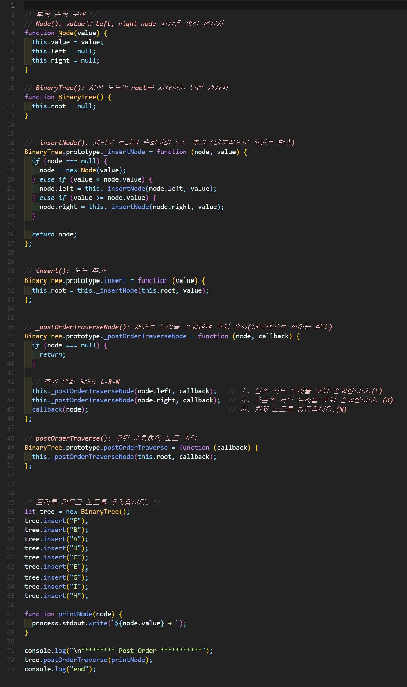


🧪 **실행결과**

```javascript

********* Post-Order ***********
A → C → E → D → B → H → I → G → F → end
```


### [4) 층별 순회(Level-order)](https://github.com/canmarkme/Today-ILearned/blob/main/%EC%9E%90%EB%A3%8C%EA%B5%AC%EC%A1%B0/%EB%B9%84%EC%84%A0%ED%98%95%20%EC%9E%90%EB%A3%8C%EA%B5%AC%EC%A1%B0/Tree/Tree_4.js)

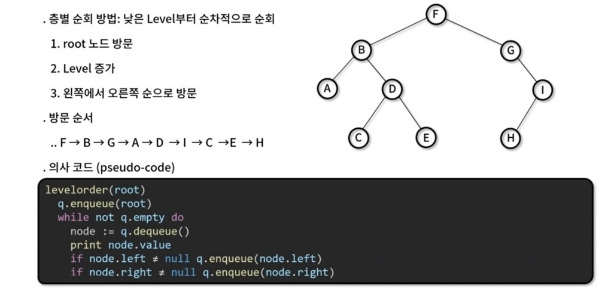


✨ **예시**

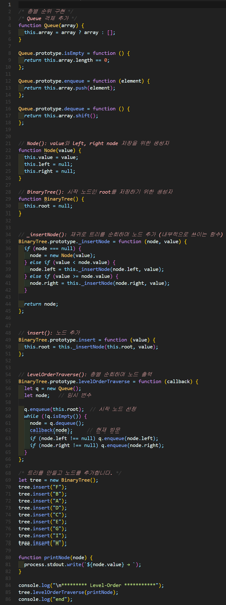

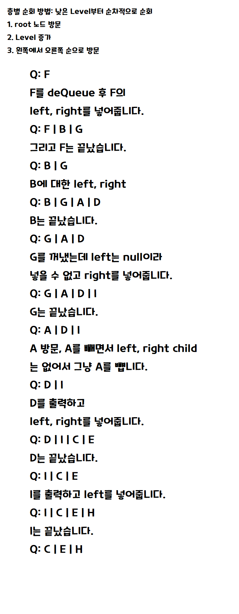

🧪 **실행결과**

```javascript

********* Level-Order ***********
F → B → G → A → D → I → C → E → H → end
```
