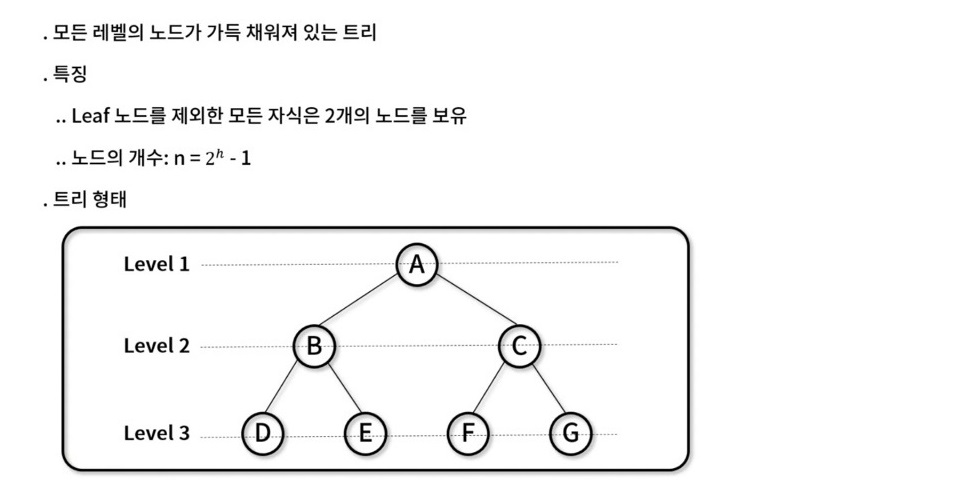
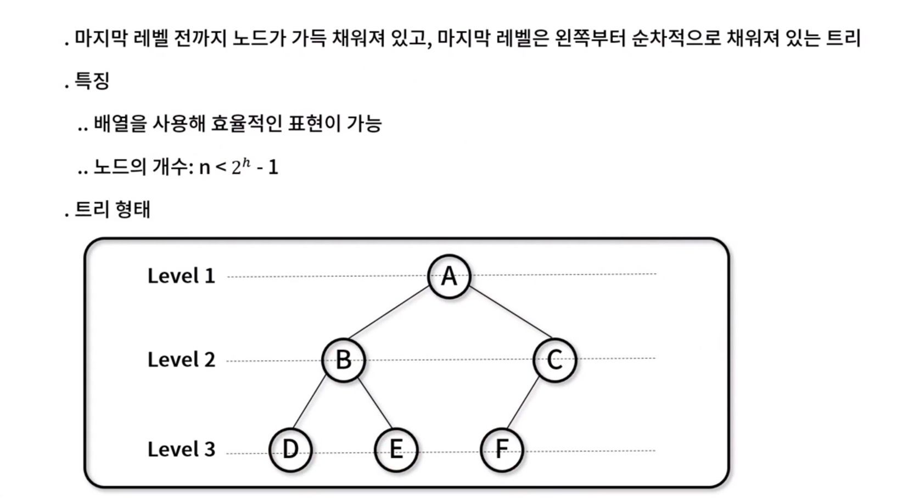
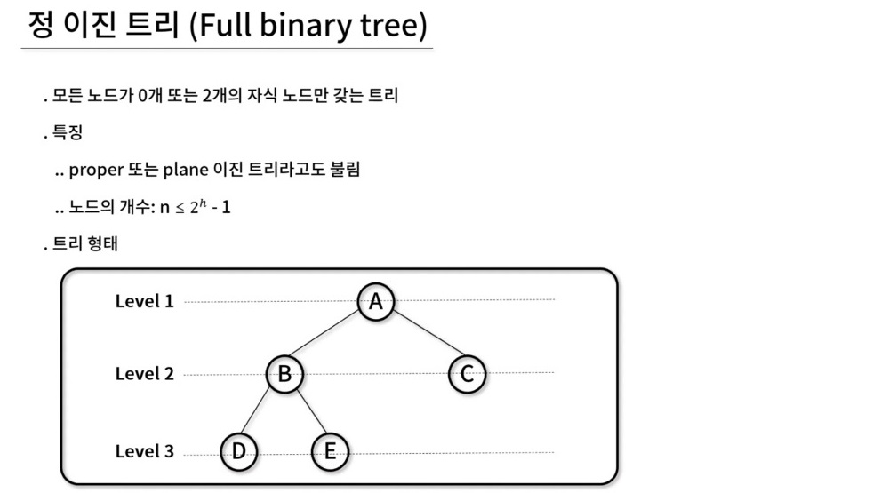
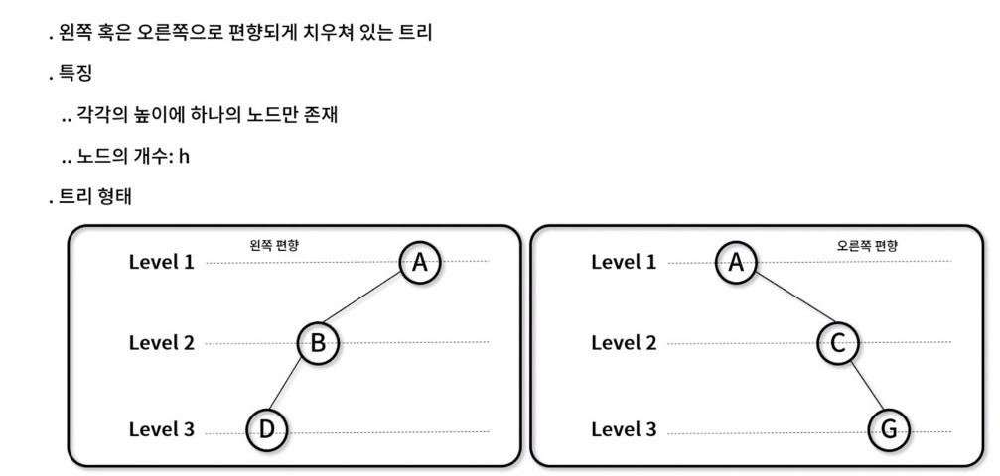
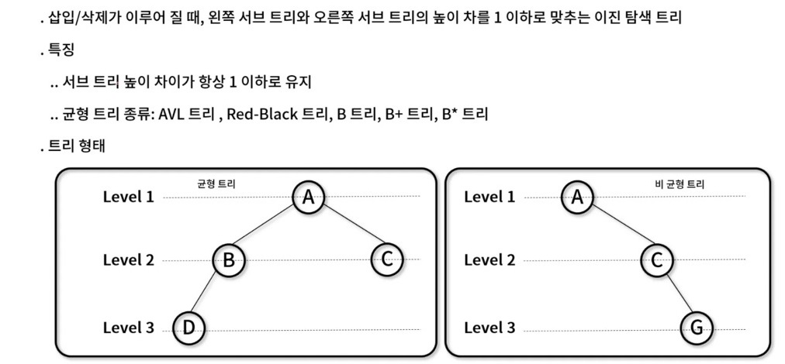
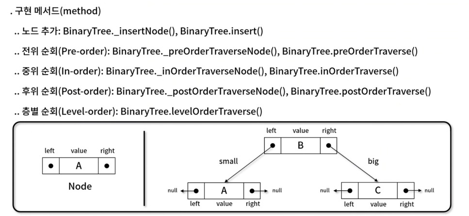

# 이진 트리(Binary tree)
- 각각의 노드가 **최대 두개의 자식 노드**를 가지는 트리 자료 구조
- 활용 방식
  - 검색과 정렬: 이진 탐색 트리와 이진 힙 구현에 활용
  - 허프만 코딩: 연관 분기 구조 위한 데이터 표현에 활용

## 1. 이진 트리의 종류

### 1) 포화 이진 트리(Perfect binary tree)

### 2) 완전 이진 트리(Complete binary tree)

### 3) 정 이진 트리(Full binary tree)

### 4) 편향 이진 트리(Skewed binary tree)

### 5) 균형 이진 트리( binary tree)

## 2. 이진 트리 순회(Binary Tree Traversal)
- 각각의 노드가 **최대 두개의 자식 노드**를 가지는 트리 자료 구조를 순회하는 방법

### 1) 전위 순위 구현

