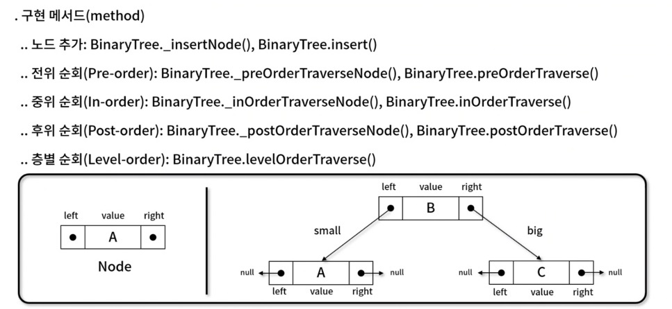
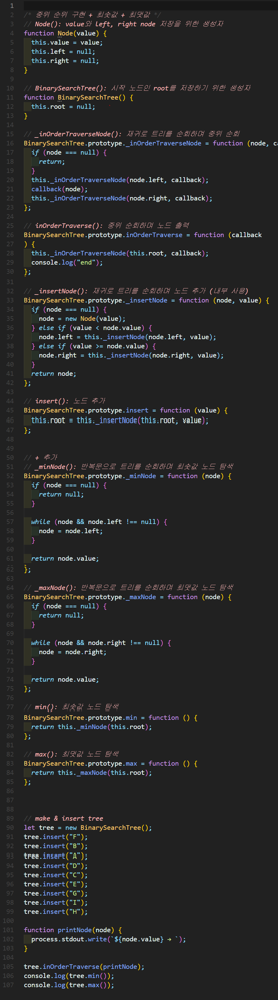
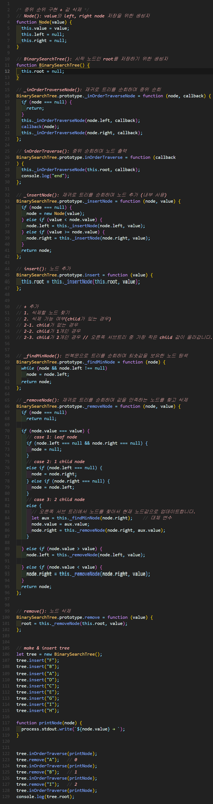

# 이진 탐색 트리(Binary search tree)


## 1. 이진 트리 순회(Binary Tree Traversal)
- 각각의 노드가 **최대 두개의 자식 노드**를 가지는 트리 자료 구조를 순회하는 방법





### 1). 최댓값과 최솟값 찾기 구현



🧪 **실행결과**


``` javascript
A → B → C → D → E → F → G → H → I → end
A
I
```

### 2) 특정값 찾기 구현


🧪 **실행결과**

``` javascript
Not found J
Found I
```


### 3) 값 삭제 구현


🧪 **실행결과**

``` javascript
A → B → C → D → E → F → G → H → I → end
B → C → D → E → F → G → H → I → end
C → D → E → F → G → H → I → end
C → D → E → F → G → H → end
Node {
  value: 'F',
  left: Node {
    value: 'D',
    left: Node { value: 'C', left: null, right: null },
    right: Node { value: 'E', left: null, right: null }
  },
  right: Node {
    value: 'G',
    left: null,
    right: Node { value: 'H', left: null, right: null }
  }
}
```