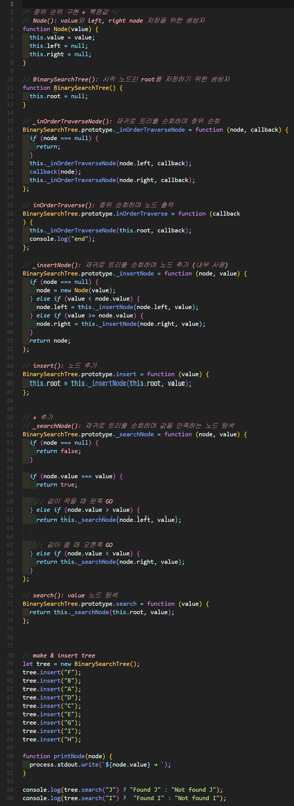

# 이진 탐색 트리(Binary search tree)


## 1. 이진 탐색 트리 구현


### 🧪 실행결과


``` javascript
Binary_search_tree { array: [ 1, 2, 3 ] }
false
[ 1, 2, 3 ]
false
{
  constructor: {
    value: [Function: Binary_search_tree],
    writable: true,
    enumerable: false,
    configurable: true
  },
  getBuffer: {
    value: [Function (anonymous)],
    writable: true,
    enumerable: true,
    configurable: true
  },
  isEmpty: {
    value: [Function (anonymous)],
    writable: true,
    enumerable: true,
    configurable: true
  }
}
```

## 2. 이진 탐색 트리 구현



### 🧪 실행결과

``` javascript
Binary_search_tree { array: [ 1, 2 ] }
Binary_search_tree { array: [ 1, 2, 3, 4 ] }
1
2
Binary_search_tree { array: [ 3, 4 ] }
```


## 3. 이진 탐색 트리 구현


### 🧪 실행결과


``` javascript
2
Binary_search_tree { array: [ 2, 3, 4 ] }
3
Binary_search_tree { array: [] }
0
```


## 4. 이진 탐색 트리 최적화 구현

- 방식 개선: enBinary_search_tree / deBinary_search_tree 방식을 push / shift에서 index로 변경 → shift()를 사용할 경우 O(n) 시간이 걸리기 때문에 index를 이용해 O(1)로 시간 단축합니다.


### 🧪 실행결과


``` javascript
Binary_search_tree { array: [ 1, 2 ], tail: 2, head: 0 }
Binary_search_tree { array: [ 1, 2, 3, 4 ], tail: 4, head: 0 }
🌭0
🧃1
1
🌭1
🧃2
2
Binary_search_tree { array: [ <2 empty items>, 3, 4 ], tail: 4, head: 2 }    
4
```


## 5. Benchmark


### 🧪 실행결과


``` javascript
enBinary_search_tree Binary_search_tree_1: 6ms
enBinary_search_tree Binary_search_tree_2: 7ms
deBinary_search_tree Binary_search_tree_1: 5382ms
enBinary_search_tree Binary_search_tree_2: 13ms
```


