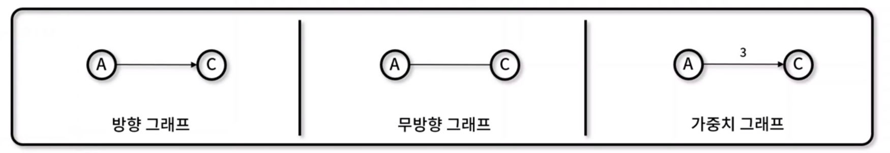
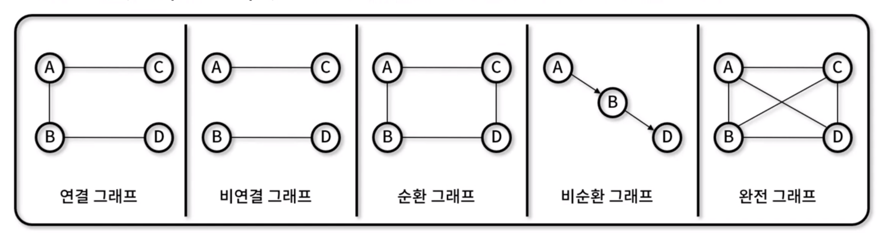
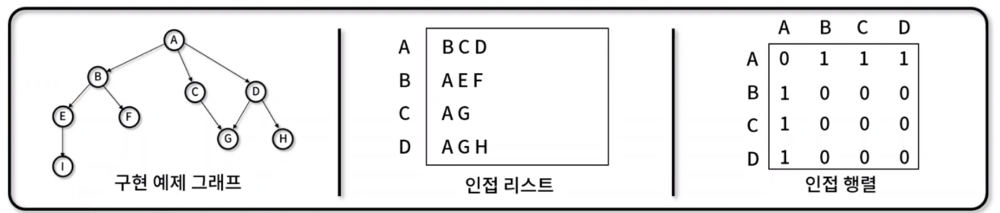
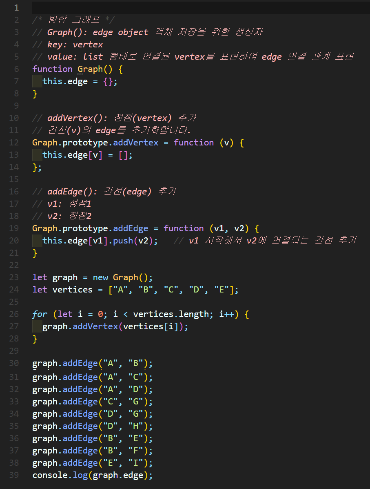
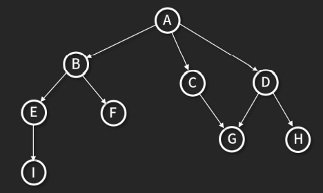
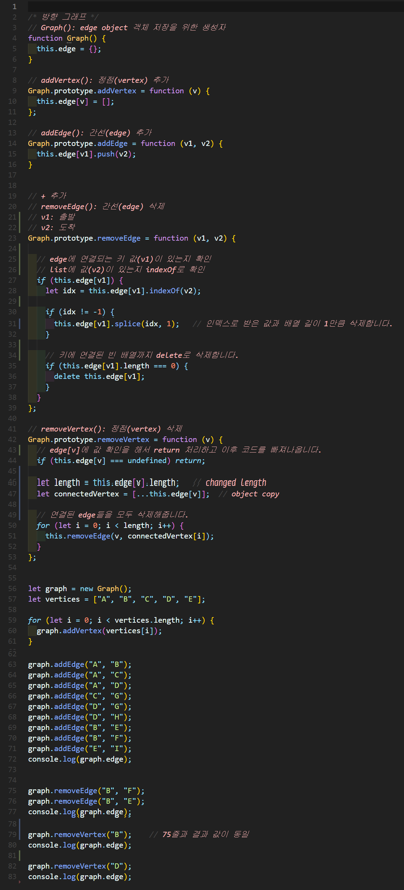
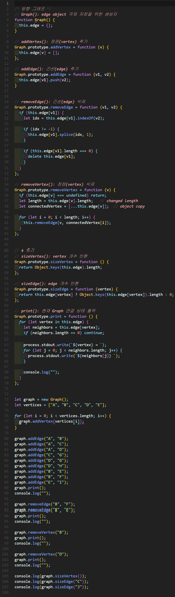
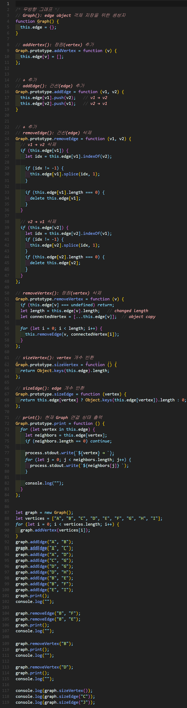

# 그래프(Graph)
- 정점과 간선으로 구성되어 **네트워크 구조**를 추상화한 비선형 자료 구조
- 예시) 길찾기, 게임, 지도, 네비게이션

- 그래프 특징
  - 정점(Vertex)과 간선(Edge)의 집합
  - 다양한 그래프 종류를 혼합하여 표현 가능
- 그래프의 관계
  - 방향 그래프(Directed Graph): 간선에 특정 방향이 존재하는 그래프(A → C로 표현, A에서 C로만 이동 가능)
  - 무방향 그래프(Undirected Grpaph): 간선에 특정 방향이 존재하지 않는 그래프(A - C로 표현, 양방향 이동 가능)
  - 가중치 그래프(Weighted Graph): 간선에 비용이나 가중치가 할당된 그래프





## 그래프 종류
- 연결 그래프(Connected Graph) : 무방향 그래프에 있는 모든 정점쌍에 대해 항상 경로가 존재하는 그래프
- 비연결 그래프(Disconnected Graph) : 무방향 그래프에서 특정 정점쌍 사이에 경로가 존재하지 않는 그래프
- 순환 그래프(Cycle Graph) : 단순 경로의 시작 정점과 종료 지점이 동일하여 순환 지점이 존재하는 그래프
- 비순환 그래프(Acyclic Graph) : 순환 지점이 존재하지 않는 그래프
- 완전 그래프(Complete Graph) : 그래프에 속해있는 모든 정점이 서로 연결되어 있는 그래프




## 그래프 표현 방법
- 인접 리스트(Adjacency List) : 정점에 연결된 다른 정점을 리스트로 표현
- 인접 행렬(Adjacency Matrix) : 정점에 연결된 다른 정점을 정점 x 정점 크기의 매트릭스로 표현


## 구현 메서드
- 정점 추가: Graph.addVertex()
- 간선 추가: Graph.addEdge()
- 정점 삭제: Graph.removeVertex()
- 간선 삭제: Graph.removeEdge()
- 정점 개수: Graph.sizeVertex()
- 간선 개수: Graph.sizeEdge()
- 그래프 출력: Graph.print()




## 그래프 구현하기
### 그래프 구현 (1)

✨ **예시**





🧪 **실행결과**

```javascript
{
  A: [ 'B', 'C', 'D' ],
  B: [ 'E', 'F' ],
  C: [ 'G' ],
  D: [ 'G', 'H' ],
  E: [ 'I' ]
}
```


### 그래프 구현 (2)

✨ **예시**




🧪 **실행결과**

```javascript
{
  A: [ 'B', 'C', 'D' ],
  B: [ 'E', 'F' ],
  C: [ 'G' ],
  D: [ 'G', 'H' ],
  E: [ 'I' ]
}
{ A: [ 'B', 'C', 'D' ], C: [ 'G' ], D: [ 'G', 'H' ], E: [ 'I' ] }
{ A: [ 'B', 'C', 'D' ], C: [ 'G' ], D: [ 'G', 'H' ], E: [ 'I' ] }
{ A: [ 'B', 'C', 'D' ], C: [ 'G' ], E: [ 'I' ] }
```


### 그래프 구현 (3)

✨ **예시**




🧪 **실행결과**

```javascript
A → B C D 
B → E F
C → G
D → G H
E → I

A → B C D
C → G
D → G H
E → I

A → B C D
C → G
D → G H
E → I

A → B C D
C → G
E → I

3
1
0
```


### 그래프 구현 (4)

✨ **예시**




🧪 **실행결과**

```javascript
A → B C D 
B → A E F
C → A G
D → A G H
E → B I
F → B 
G → C D
H → D
I → E

A → B C D
B → A
C → A G
D → A G H
E → I
G → C D
H → D
I → E

A → C D
C → A G
D → A G H 
E → I
G → C D
H → D
I → E

A → C
C → A G
E → I
G → C
I → E

5
2
0
```
