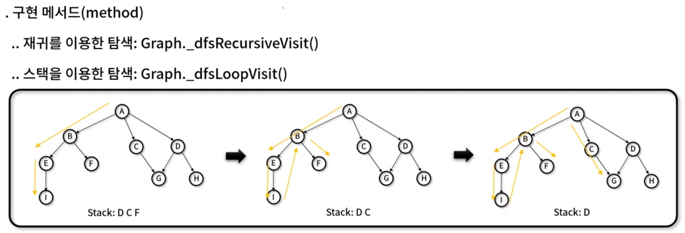
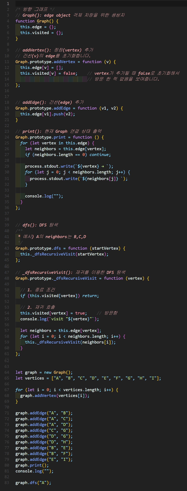
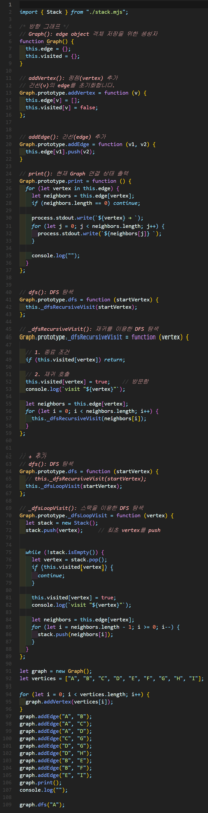

# DFS(Depth First Search) 
- 트리나 DFS 등에서 하나의 노드를 최대한 깊게 들어가면서 해를 찾는 탐색 기법
- 장점 : 인접한 후보 노드만 기억하면 되므로 적은 기억공간 소요, 노드가 깊은 단계에 있을 경우 빠르게 정답 산출
- 단점 : 선택한 경로가 답이 아닐 경우 불필요한 탐색 가능, 최단 경로를 구할 시 찾은 해가 정답이 아닐 경우 발생. 최단경로는 BFS로 구합니다.




## DFS 구현하기
### 재귀를 이용한 DFS 구현

✨ **예시**




🧪 **실행결과**

```javascript
A → B C D 
B → E F
C → G
D → G H
E → I

visit "A"
visit "B"
visit "E"
visit "I"
visit "F"
visit "C"
visit "G"
visit "D"
visit "H"
```

### 스택을 이용한 DFS 구현

✨ **예시**




🧪 **실행결과**

```javascript
0
-1
true
false
A → B C D
B → E F
C → G
D → G H
E → I

visit "A"
visit "B"
visit "E"
visit "I"
visit "F"
visit "C"
visit "G"
visit "D"
visit "H"
```