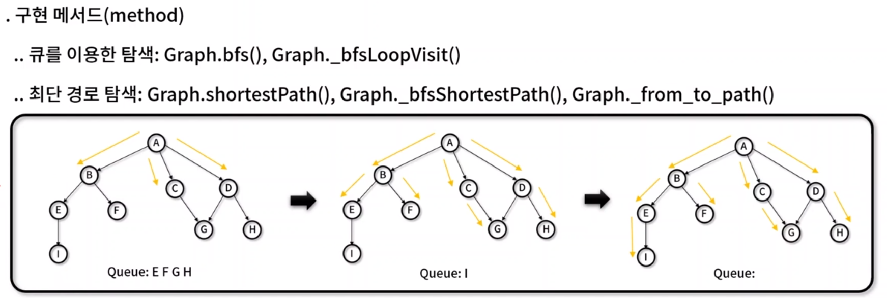
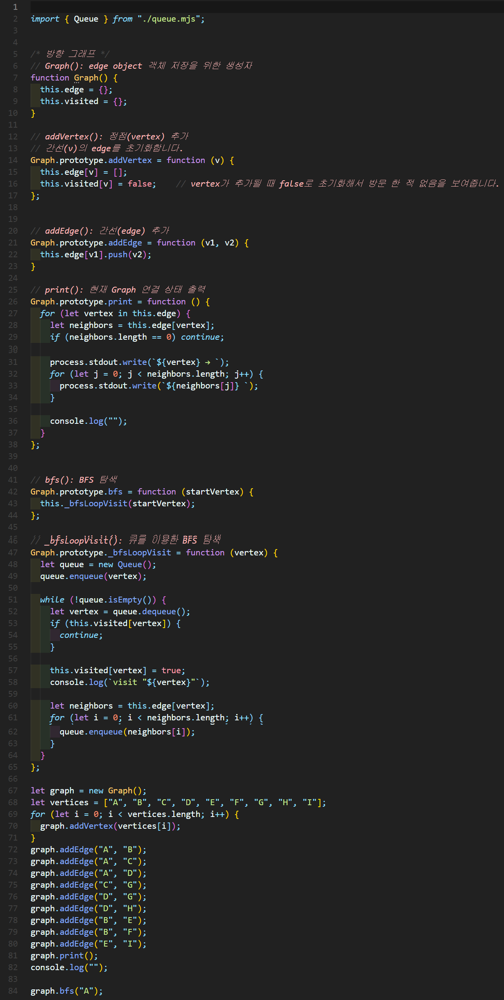
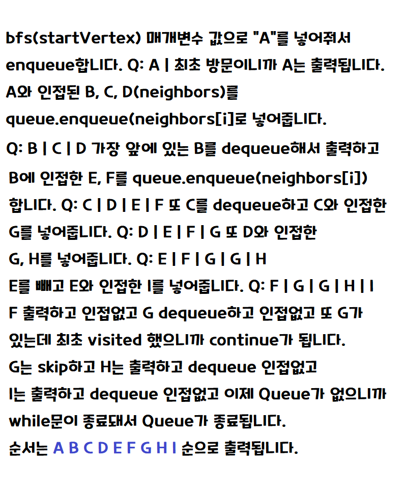
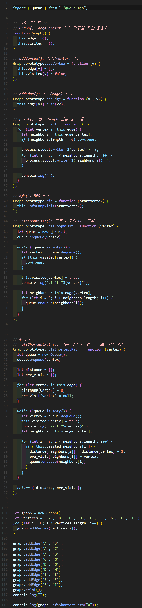
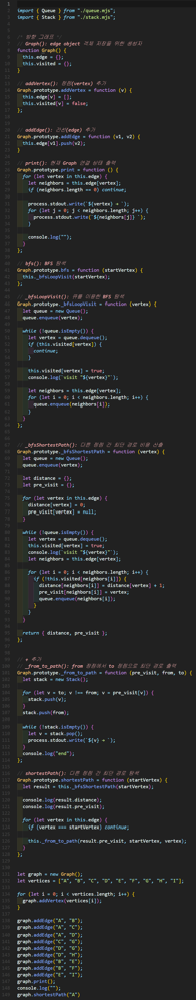

# BFS(Breadth First Search) 
- 트리나 그래프 등에서 **인접한 노드를 우선 방문**하면서 **넓게** 움직이며 해를 찾는 탐색 기법
- 장점 : 최단 경로 탐색에서 구한 해가 정답임을 보장
- 단점 : 경로가 매우 길어질 경우, 탐색 범위가 증가하면서 BFS보다 많은 기억 공간이 필요
- 예시) 미로찾기, 네트워크 빠른 라우팅 path, Astar, 다양한 경로 탐색 문제




## BFS 구현하기
### BFS 구현

✨ **예시**





🧪 **실행결과**

```javascript
2
Queue { array: [ 2, 3, 4 ] }
3
Queue { array: [] }
0
A → B C D
B → E F
C → G
D → G H
E → I

visit "A"
visit "B"
visit "C"
visit "D"
visit "E"
visit "F"
visit "G"
visit "H"
visit "I"
```


### BFS 구현

✨ **예시**




🧪 **실행결과**

```javascript
2
Queue { array: [ 2, 3, 4 ] }
3
Queue { array: [] }
0
A → B C D
B → E F
C → G
D → G H
E → I

visit "A"
visit "B"
visit "C"
visit "D"
visit "E"
visit "F"
visit "G"
visit "G"
visit "H"
visit "I"
{
  distance: { A: 0, B: 1, C: 1, D: 1, E: 2, F: 2, G: 2, H: 2, I: 3 },
  pre_visit: {
    A: null,
    B: 'A',
    C: 'A',
    D: 'A',
    E: 'B',
    F: 'B',
    G: 'D',
    H: 'D',
    I: 'E'
  }
}
```

### BFS 구현

✨ **예시**




🧪 **실행결과**

```javascript
A → B C D 
B → E F
C → G
D → G H
E → I

visit "A"
visit "B"
visit "C"
visit "D"
visit "E"
visit "F"
visit "G"
visit "G"
visit "H"
visit "I"
{ A: 0, B: 1, C: 1, D: 1, E: 2, F: 2, G: 2, H: 2, I: 3 }
{
  A: null,
  B: 'A',
  C: 'A',
  D: 'A',
  E: 'B',
  F: 'B',
  G: 'D',
  H: 'D',
  I: 'E'
}
A → B → end
A → C → end
A → D → end
A → B → E → end
A → B → F → end
A → D → G → end
A → D → H → end
A → B → E → I → end
```