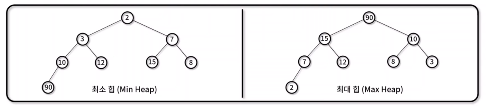
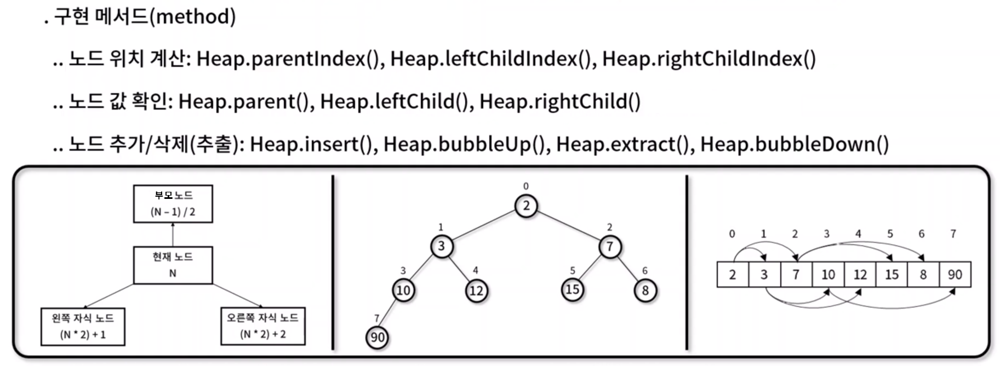
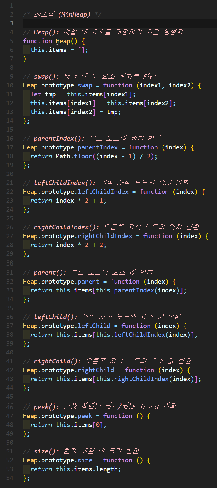
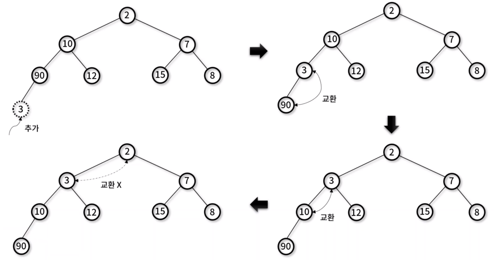
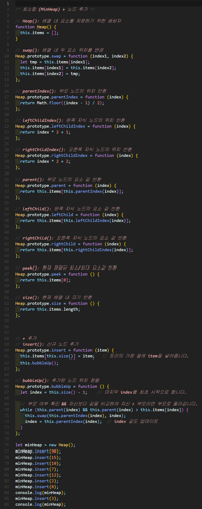
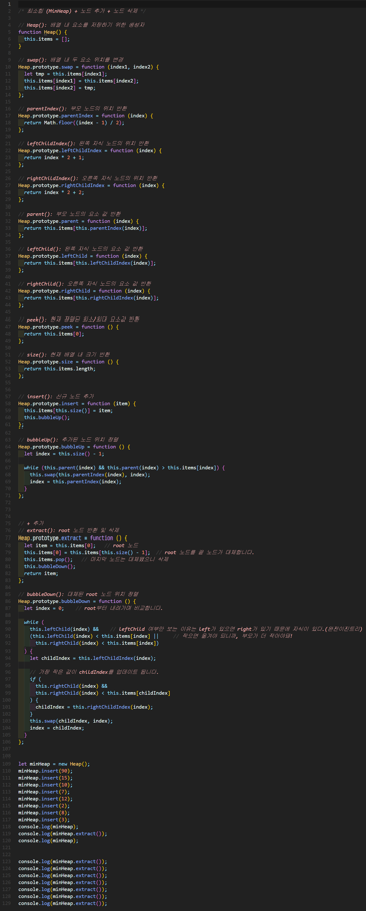
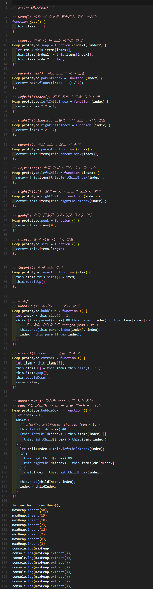

# 힙(Heap)
- 최대값 혹은 최소값을 빠르게 찾기 위해 **완전이진트리** 형태로 연산을 수행하는 자료 구조
- 힙 대표 속성
  - 정렬 : 각 노드의 값은 자식 노드가 가진 값보다 **작거나** 혹은 **큰** 순서대로 정렬
  - 형태 : 트리의 형태는 **완전이진트리(complete binary tree)** 모양 → **배열**로 표현 가능
- 종류
  - 최소 힙(Min Heap) : 부모 노드의 값이 자식 노드의 값보다 작거나 같은 완전 이진 트리
  - 최대 힙(Max Heap) : 부모 노드의 값이 자식 노드의 값보다 크거나 같은 완전 이진 트리




- 힙 구현
  - 완전이진트리 성질을 만족하기 때문에 1차원 배열로 표현 가능하다
  - 현재 노드는 N, 부모 노드 (N-1)/2, 왼쪽 자식 노드 (N * 2) + 1, 오른쪽 자식 노드 (N * 2) + 2




## Heap 구현하기
### 최소힙 구현

✨ **예시**



### 최소힙 구현 + 노드 추가
- 마지막에 insert하고 실제 있어야 할 자리로 이동



✨ **예시**




🧪 **실행결과**

```javascript
Heap { items: [
     2, 10, 7, 90,
    12, 15, 8
  ] }
Heap { items: [
     2,  3, 7, 10,
    12, 15, 8, 90
  ] }
```


### 최소힙 구현 + 노드 삭제

✨ **예시**




🧪 **실행결과**

```javascript
Heap { items: [   
     2,  3, 7, 10,
    12, 15, 8, 90 
  ] }
2
Heap { items: [
     3, 10, 7, 90,
    12, 15, 8
  ] }
3
7
8
10
12
15
90
```

### 최대힙 구현

✨ **예시**




🧪 **실행결과**

```javascript
Heap { items: [
    90, 15, 10, 7,
    12,  2,  8, 3
  ] }
90
15
12
10
8
7
3
2
```