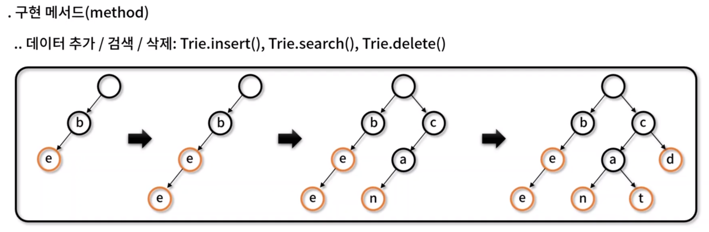
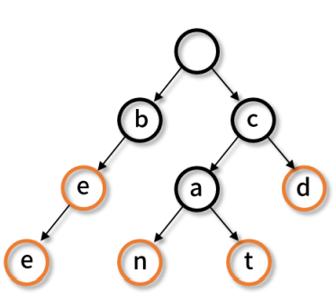
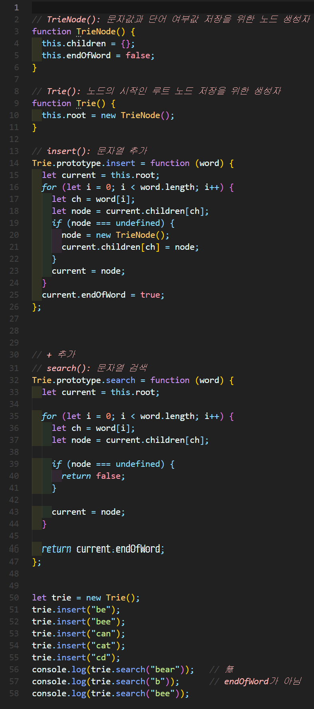
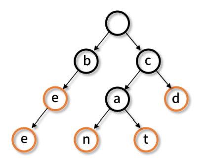
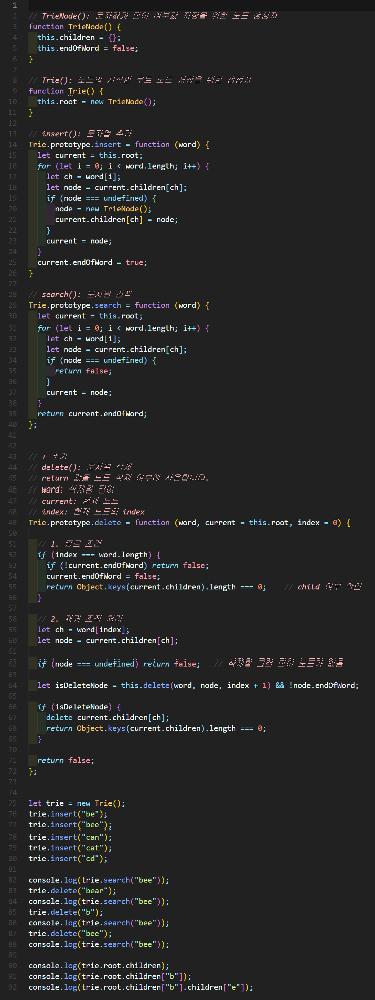
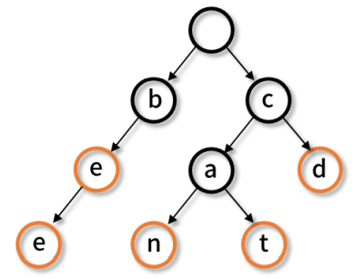

# 트라이(Trie)
- 탐색 트리의 일종으로, 문자열이나 연관 배열을 저장하는데 사용되는 트리 자료 구조
- **쿤자열 검색**에 특화되어있으며, 문자열 길이가 M인 경우 O(M)의 시간 복잡도로 검색이 가능하다




## 트라이 구현하기
### 구현

✨ **예시**





🧪 **실행결과**

```javascript
TrieNode {
  children: {
    b: TrieNode { children: [Object], endOfWord: false },
    c: TrieNode { children: [Object], endOfWord: false } 
  },
  endOfWord: false
}
TrieNode {
  children: {
    a: TrieNode { children: [Object], endOfWord: false },
    d: TrieNode { children: {}, endOfWord: true }
  },
  endOfWord: false
}
```

### 구현

✨ **예시**






🧪 **실행결과**

```javascript
false
false
true
```

### 구현

✨ **예시**






🧪 **실행결과**

```javascript
true
true
true
false
{
  b: TrieNode { children: { e: [TrieNode] }, endOfWord: false },
  c: TrieNode {
    children: { a: [TrieNode], d: [TrieNode] },
    endOfWord: false
  }
}
TrieNode {
  children: { e: TrieNode { children: {}, endOfWord: true } },
  endOfWord: false
}
TrieNode { children: {}, endOfWord: true }
```


