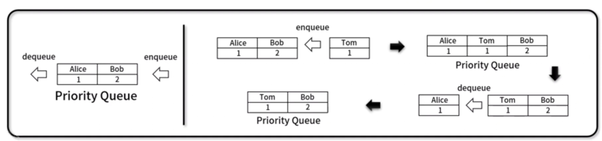
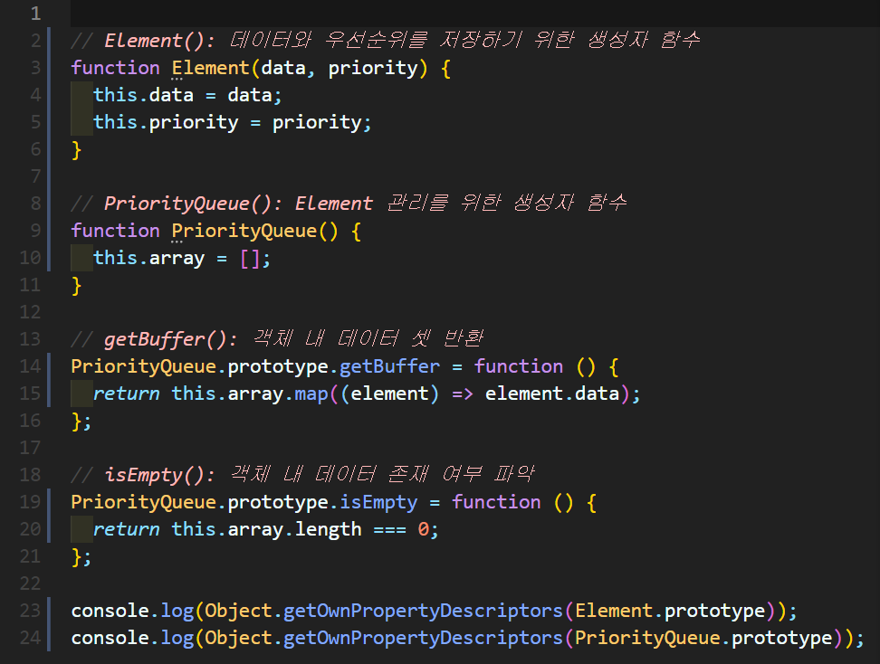
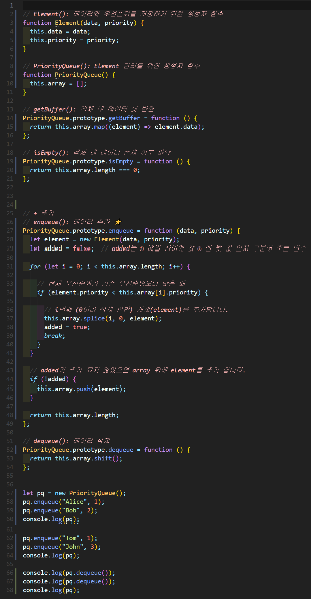
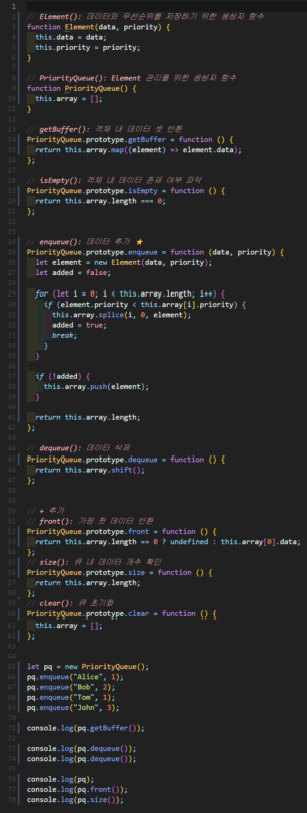

# 우선순위 큐(Priority_queue)
- 우선순위를 고려하여 먼저 넣은 데이터가 먼저 나오는 **FIFO(First In First Out)** 기반의 선형 자료구조
- 우선 순위 정렬 방식 **① 배열 기반** ② 연결리스트 기반 ③ 힙 기반
- Element = 우선순위 요소 + 데이터 요소
- 예시) 응급실




## 1. 우선순위 큐 구현


### 🧪 실행결과


``` javascript
{
  constructor: {
    value: [Function: Element],
    writable: true,
    enumerable: false,
    configurable: true
  }
}
{
  constructor: {
    value: [Function: PriorityQueue],
    writable: true,
    enumerable: false,
    configurable: true
  },
  getBuffer: {
    value: [Function (anonymous)],
    writable: true,
    enumerable: true,
    configurable: true
  },
  isEmpty: {
    value: [Function (anonymous)],
    writable: true,
    enumerable: true,
    configurable: true
  }
}
```

## 2. 우선순위 큐 구현



### 🧪 실행결과

``` javascript
PriorityQueue {
  array: [
    Element { data: 'Alice', priority: 1 },
    Element { data: 'Bob', priority: 2 }   
  ]
}
PriorityQueue {
  array: [     
    Element { data: 'Alice', priority: 1 },
    Element { data: 'Tom', priority: 1 },
    Element { data: 'Bob', priority: 2 },
    Element { data: 'John', priority: 3 }
  ]
}
Element { data: 'Alice', priority: 1 }
Element { data: 'Tom', priority: 1 }
PriorityQueue {
  array: [
    Element { data: 'Bob', priority: 2 },
    Element { data: 'John', priority: 3 }
  ]
}              
```


## 3. 우선순위 큐 구현


### 🧪 실행결과


``` javascript
[ 'Alice', 'Tom', 'Bob', 'John' ]
Element { data: 'Alice', priority: 1 }   
Element { data: 'Tom', priority: 1 }     
PriorityQueue {
  array: [
    Element { data: 'Bob', priority: 2 },
    Element { data: 'John', priority: 3 }
  ]
}
Bob
2
```


