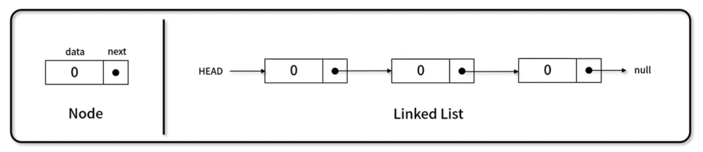
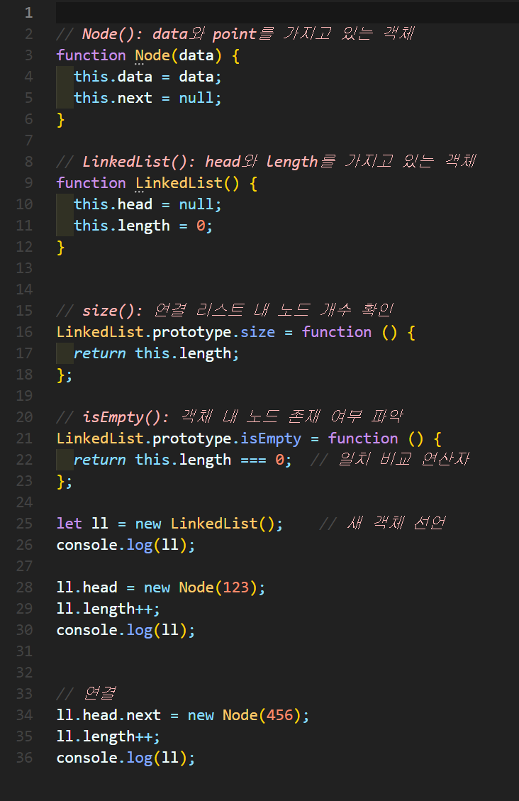
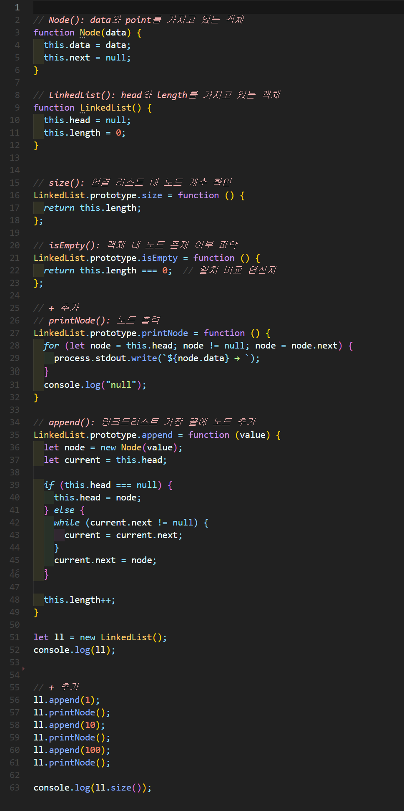
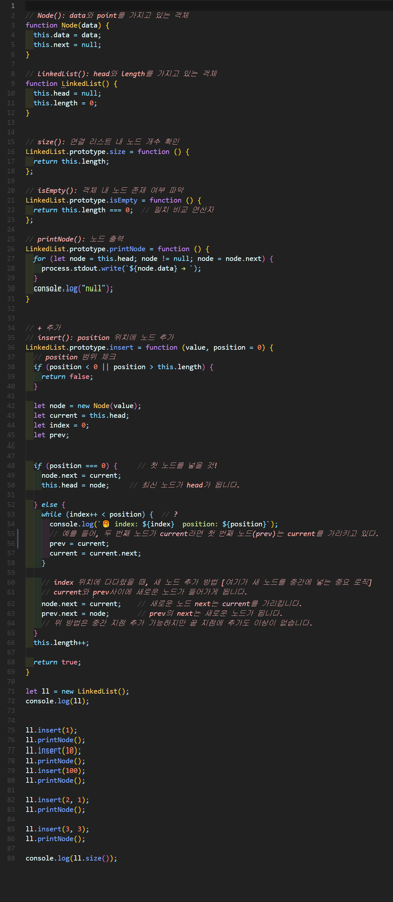
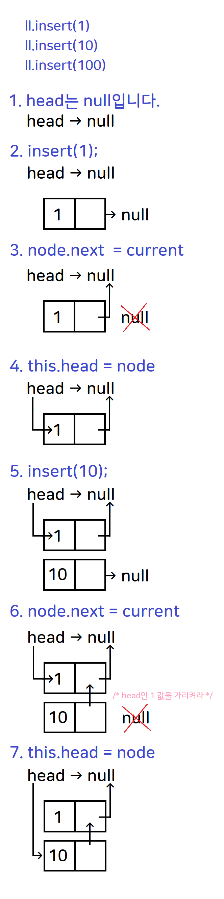
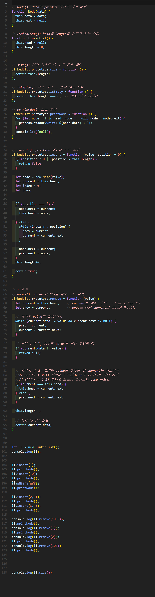
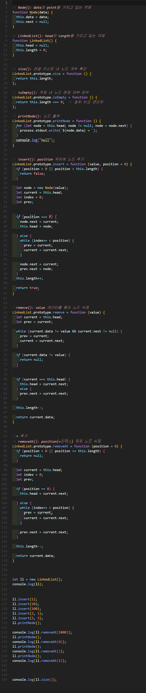
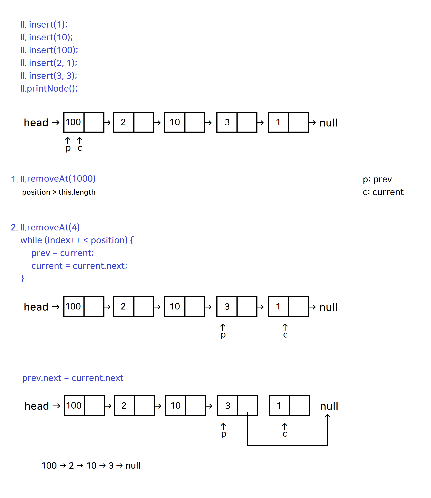
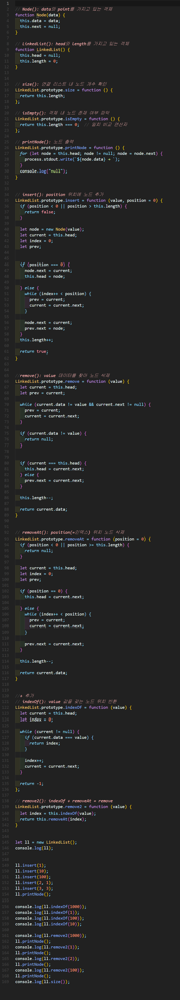
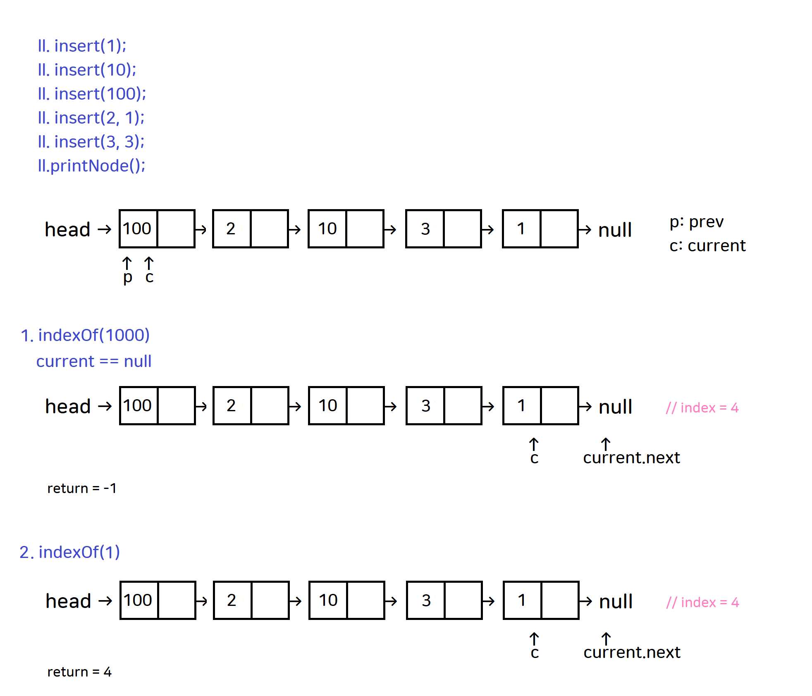

# 연결 리스트(Linked List)
각 노드가 데이터와 포인터를 가지며, 여러 노드를 **한 줄**로 연결해 놓은 자료 구조

- 더 이상 가리킬 노드가 없을때 next에 null이 저장됩니다.
- 헤드는 첫 번째 노드를 가리키는 포인터
- Node = Data & Next




## 1. 연결리스트 구현


### 🧪 실행결과


``` javascript
LinkedList { head: null, length: 0 }
LinkedList { head: Node { data: 123, next: null }, length: 1 }        
LinkedList {
  head: Node { data: 123, next: Node { data: 456, next: null } },     
  length: 2
}
```

## 2. 연결리스트 구현


### 🧪 실행결과


``` javascript
LinkedList { head: null, length: 0 }
1 → null
1 → 10 → null      
1 → 10 → 100 → null
3
```


## 3. 연결리스트 구현


### 🧪 실행결과


``` javascript
LinkedList { head: null, length: 0 }
1 → null
10 → 1 → null
100 → 10 → 1 → null     
🥞 index: 1  position: 1
100 → 2 → 10 → 1 → null 
🥞 index: 1  position: 3
🥞 index: 2  position: 3
🥞 index: 3  position: 3
100 → 2 → 10 → 3 → 1 → null
5
```

### 🍒 풀이




## 4. 연결리스트 구현



### 🍒 풀이


### 🧪 실행결과


``` javascript
LinkedList { head: null, length: 0 }
1 → null
10 → 1 → null
100 → 10 → 1 → null        
100 → 2 → 10 → 1 → null    
100 → 2 → 10 → 3 → 1 → null
null
100 → 2 → 10 → 3 → 1 → null
1
100 → 2 → 10 → 3 → null    
2
100 → 10 → 3 → null        
100
10 → 3 → null
2
```


## 5. 연결리스트 구현



### 🍒 풀이




### 🧪 실행결과


``` javascript
LinkedList { head: null, length: 0 }
100 → 2 → 10 → 3 → 1 → null
null
100 → 2 → 10 → 3 → 1 → null
1
100 → 2 → 10 → 3 → null
100
2 → 10 → 3 → null
10
2 → 3 → null
2
```


## 6. 연결리스트 구현



### 🍒 풀이




### 🧪 실행결과


``` javascript
LinkedList { head: null, length: 0 }
100 → 2 → 10 → 3 → 1 → null
-1
4
0
2
null
100 → 2 → 10 → 3 → 1 → null
1
100 → 2 → 10 → 3 → null
2
100 → 10 → 3 → null
100
10 → 3 → null
2
```


###  열차연결 구현

✨ **풀이**


```javascript

let input = [
  [4, 7, 1, 10, 6],
  [3, 10, 6, 9, 11, 3, 4],
  [5, 8, 7, 3, 4, 1, 2, 7, 10, 7]
];

LinkedList.prototype.printNode = function () {
  for (let node = this.head; node != null; node = node.next) {
    process.stdout.write(`${node.number} → `);
  }
  console.log("null");
};

for (let i = 0; i < input.length; i++) {
  process.stdout.write(`#${i + 1} `);
  answer(input[i]).printNode();
}

function Train(number) {
  this.number = number;
  this.next = null;
}

function LinkedList() {
  this.haed = null;
}

function answer(nums) {
  let ll = new LinkedList();
  let current, prev;     

  for (let i = 0; i < nums.length; i++) {
    current = new Train(nums[i]);

    if (i === 0) {
      ll.head = current;

    } else {
      prev.next = current;
    }

    prev = current;  
  }

  return ll;
}

```


🧪 **실행결과**
```javascript
#1 4 → 7 → 1 → 10 → 6 → null
#2 3 → 10 → 6 → 9 → 11 → 3 → 4 → null
#3 5 → 8 → 7 → 3 → 4 → 1 → 2 → 7 → 10 → 7 → null
```