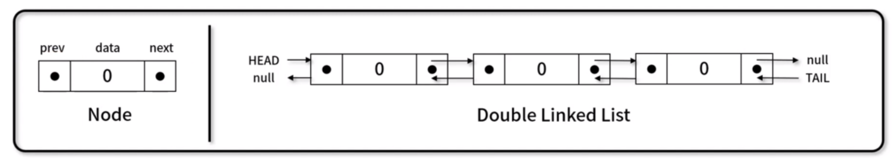
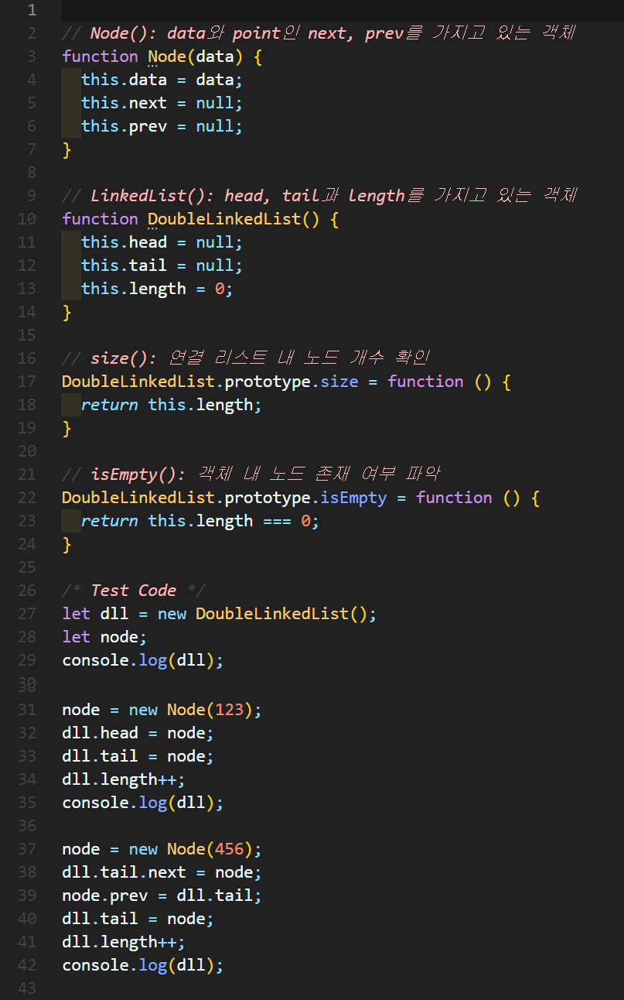
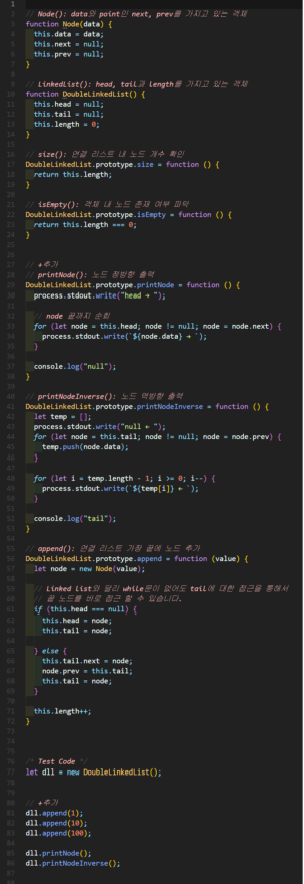
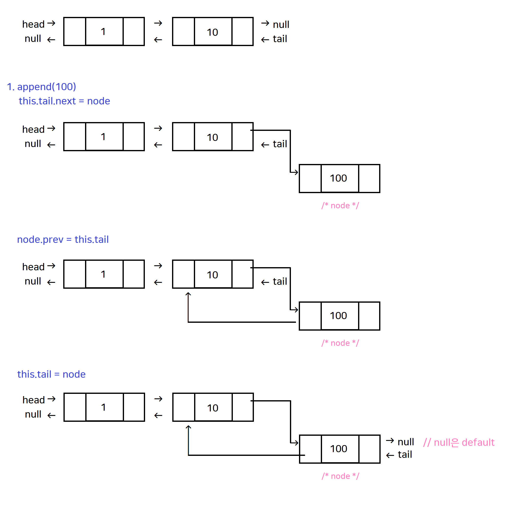
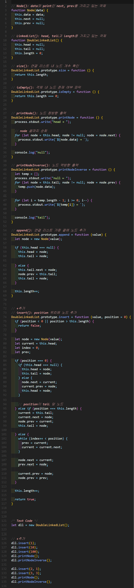
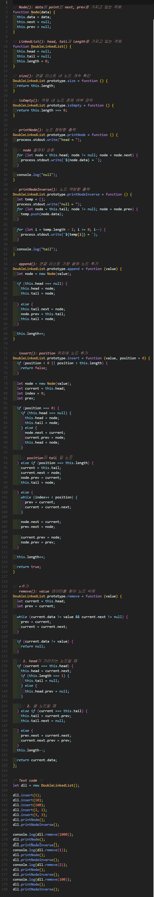
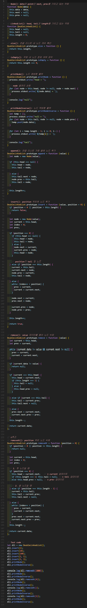
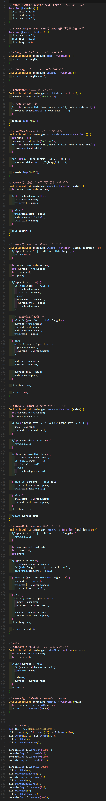

# 이중 연결 리스트(Double linked List)
각 노드가 데이터와 포인터를 가지며, **두 줄**로 연결되어 있는 방식으로 데이터를 저장하는 자료 구조

- prev 포인터가 추가됩니다.
- 이전 객체 접근에 가능
- 뒤에서 탐색이 가능




## 1. 이중 연결 리스트 구현


### 🧪 실행결과


``` javascript
DoubleLinkedList { head: null, tail: null, length: 0 }
DoubleLinkedList {
  head: Node { data: 123, next: null, prev: null },
  tail: Node { data: 123, next: null, prev: null },
  length: 1
}
DoubleLinkedList {
  head: <ref *1> Node {
    data: 123,
    next: Node { data: 456, next: null, prev: [Circular *1] },
    prev: null
  },
  tail: <ref *2> Node {
    data: 456,
    next: null,
    prev: <ref *1> Node {
      data: 123,
      next: [Circular *2],
      prev: null
    }
  },
  length: 2
}
```

## 2. 이중 연결 리스트 구현



### 🍒 풀이




### 🧪 실행결과

``` javascript
head → 1 → 10 → 100 → null
null ← 1 ← 10 ← 100 ← tail
```


## 3. 이중 연결 리스트 구현


### 🧪 실행결과


``` javascript
head → 100 → 10 → 1 → null
null ← 100 ← 10 ← 1 ← tail
head → 100 → 2 → 10 → 3 → 1 → null
null ← 100 ← 2 ← 10 ← 3 ← 1 ← tail
```


## 4. 이중 연결 리스트 구현



### 🧪 실행결과


``` javascript
head → 100 → 2 → 10 → 3 → 1 → null
null ← 100 ← 2 ← 10 ← 3 ← 1 ← tail
null
head → 100 → 2 → 10 → 3 → 1 → null
null ← 100 ← 2 ← 10 ← 3 ← 1 ← tail
1
head → 100 → 2 → 10 → 3 → null
null ← 100 ← 2 ← 10 ← 3 ← tail
2
head → 100 → 10 → 3 → null
null ← 100 ← 10 ← 3 ← tail
100
head → 10 → 3 → null
null ← 10 ← 3 ← tail
```


## 5. 이중 연결 리스트 구현



### 🧪 실행결과


``` javascript
head → 100 → 2 → 10 → 3 → 1 → null
null ← 100 ← 2 ← 10 ← 3 ← 1 ← tail
null
head → 100 → 2 → 10 → 3 → 1 → null
null ← 100 ← 2 ← 10 ← 3 ← 1 ← tail
1
head → 100 → 2 → 10 → 3 → null
null ← 100 ← 2 ← 10 ← 3 ← tail
100
head → 2 → 10 → 3 → null
null ← 2 ← 10 ← 3 ← tail
10
head → 2 → 3 → null
null ← 2 ← 3 ← tail
```


## 6. 이중 연결 리스트 구현



### 🧪 실행결과


``` javascript
head → 100 → 2 → 10 → 3 → 1 → null
null ← 100 ← 2 ← 10 ← 3 ← 1 ← tail
-1
4
0
2
null
head → 100 → 2 → 10 → 3 → 1 → null
null ← 100 ← 2 ← 10 ← 3 ← 1 ← tail
1
head → 100 → 2 → 10 → 3 → null
null ← 100 ← 2 ← 10 ← 3 ← tail
2
head → 100 → 10 → 3 → null
null ← 100 ← 10 ← 3 ← tail
100
head → 10 → 3 → null
null ← 10 ← 3 ← tail
2
```


###  서류정리 구현

✨ **풀이**


```javascript

function File(number) {
  this.number = number;
  this.next = null;
}

function LinkedList() {
  this.head = null;
}

function answer(ll) {
  let current = ll.head;
  let prev = null;
  let next;

  while (current != null) {
    next = current.next;
    current.next = prev;
    prev = current;
    current = next;
  }

 
  ll.head = prev;

  return ll;
}

let input = [
  [7, 3, 1],
  [4, 6, 9, 1, 3],
  [3, 4, 1, 2, 7, 9, 6],
];

LinkedList.prototype.printNode = function () {
  for (let node = this.head; node != null; node = node.next) {
    process.stdout.write(`${node.number} -> `);
  }
  console.log("null");
};

LinkedList.prototype.makeFiles = function (files) {
  let current = this.head;
  let node;
  for (let i = 0; i < files.length; i++) {
    node = new File(files[i]);
    node.next = current;
    this.head = node;

    current = node;
  }
};

for (let i = 0; i < input.length; i++) {
  process.stdout.write(`#${i + 1} `);

  let ll = new LinkedList();
  ll.makeFiles(input[i]);
  answer(ll).printNode();
}
```


🧪 **실행결과**
```javascript
#1 7 -> 3 -> 1 -> null
#2 4 -> 6 -> 9 -> 1 -> 3 -> null
#3 3 -> 4 -> 1 -> 2 -> 7 -> 9 -> 6 -> null
```