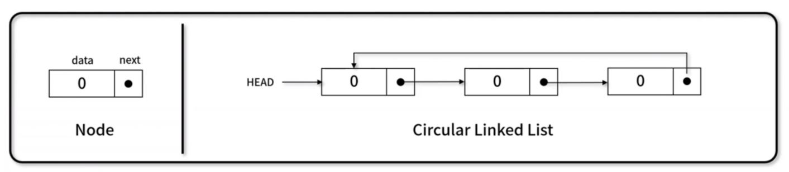
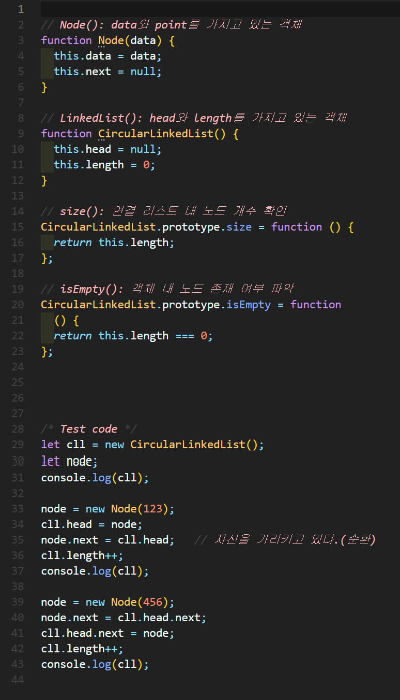
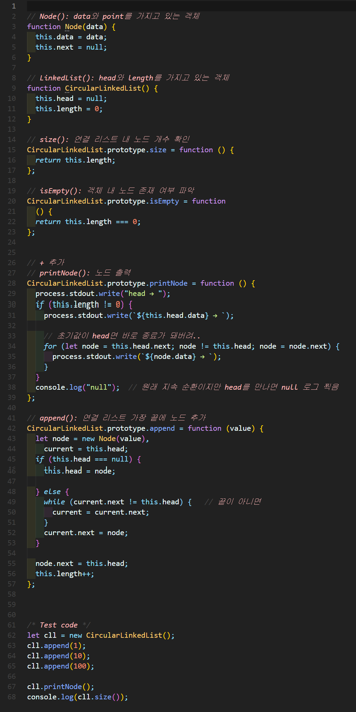
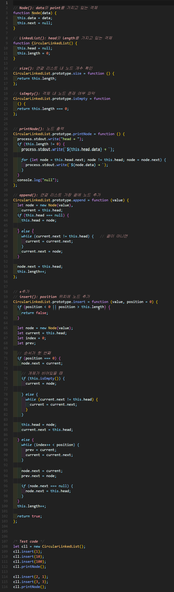
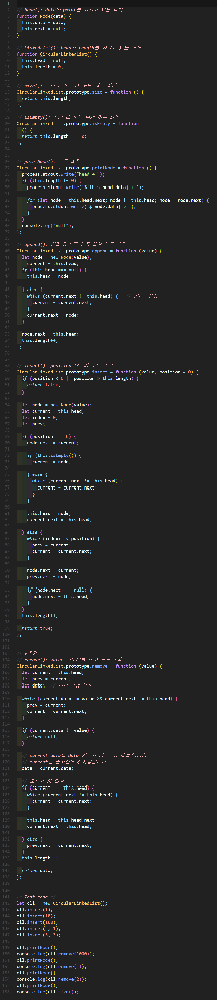
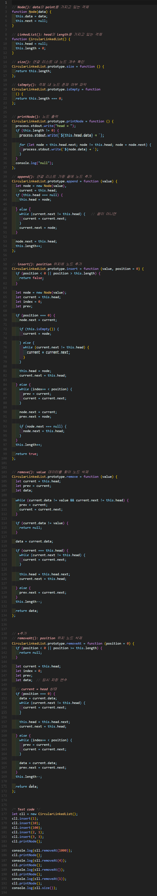
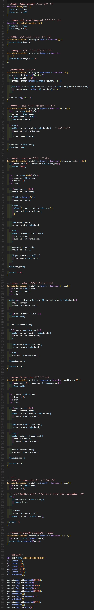

# 원형 연결 리스트(Circle linked List)
각 노드가 데이터와 포인터를 가지며, **원형 형태**로 연결되어 있는 방식으로 데이터를 저장하는 자료 구조

- 마지막 노드는 head를 갖는 노드를 가리킵니다.




## 1. 원형 연결 리스트 구현


### 🧪 실행결과


``` javascript
CircularLinkedList { head: null, length: 0 }
CircularLinkedList {
  head: <ref *1> Node { data: 123, next: [Circular *1] },
  length: 1
}
CircularLinkedList {
  head: <ref *1> Node {
    data: 123,
    next: Node { data: 456, next: [Circular *1] }
  },
  length: 2
}
```

## 2. 원형 연결 리스트 구현



### 🧪 실행결과

``` javascript
head → 1 → 10 → 100 → null
3
```


## 3. 원형 연결 리스트 구현


### 🧪 실행결과


``` javascript
head → 100 → 10 → 1 → null
head → 100 → 2 → 10 → 3 → 1 → null
```


## 4. 원형 연결 리스트 구현



### 🧪 실행결과


``` javascript
head → 100 → 2 → 10 → 3 → 1 → null
null
head → 100 → 2 → 10 → 3 → 1 → null
1
head → 100 → 2 → 10 → 3 → null
2
head → 100 → 10 → 3 → null
100
head → 10 → 3 → null
2
```


## 5. 원형 연결 리스트 구현



### 🧪 실행결과


``` javascript
head → 100 → 2 → 10 → 3 → 1 → null
null
head → 100 → 2 → 10 → 3 → 1 → null
1
head → 100 → 2 → 10 → 3 → null
100
head → 2 → 10 → 3 → null
10
head → 2 → 3 → null
2
```


## 6. 원형 연결 리스트 구현



### 🧪 실행결과


``` javascript
head → 100 → 2 → 10 → 3 → 1 → null
-1
4
0
2
null
head → 100 → 2 → 10 → 3 → 1 → null
1
head → 100 → 2 → 10 → 3 → null
2
head → 100 → 10 → 3 → null
100
head → 10 → 3 → null
2
```


###  대표선출 구현

✨ **풀이**


```javascript

let input = [
  [8, 2, 3],
  [10, 2, 3],
  [20, 5, 7]
];

for (let i = 0; i < input.length; i++) {
  process.stdout.write(`#${i + 1} `);
  console.log(answer(input[i][0], input[i][1], input[i][2]));
}

function Node(data) {
  this.data = data;
  this.next - null;
}

function LinkedList() {
  this.head = null;
}

// m: 시작위치
// k: 이동 수
function answer(n, m, k) {
  let result = [];
  let ll = new LinkedList();
  let current, prev;
  for (let i = 1; i <= n; i++) {
    current = new Node(i);

    if (i === 1) {
      ll.head = current;

    } else {
      prev.next = current;
    }

    prev = current;
  }

  current.next = ll.head; 

  current = ll.head;

  while (--m) {
    prev = current;
    current = current.next;
  }

  let count;
  while (current.next != current) {
    result.push(current.data);
    prev.next = current.next;   

    count = k;
    while (count--) {
      prev = current;
      current = current.next;
    }
  }

  result.push(current.data);

  return result;
}


```


🧪 **실행결과**
```javascript
#1 [
  2, 5, 8, 4,
  1, 7, 3, 6
]
#2 [
   2, 5, 8, 1, 6,
  10, 7, 4, 9, 3
]
#3 [
   5, 12, 19,  7, 15, 3, 13,
   2, 14,  6, 18, 11, 9,  8,
  10, 17,  4, 16, 20, 1
]
```