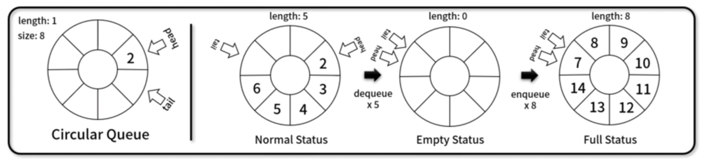
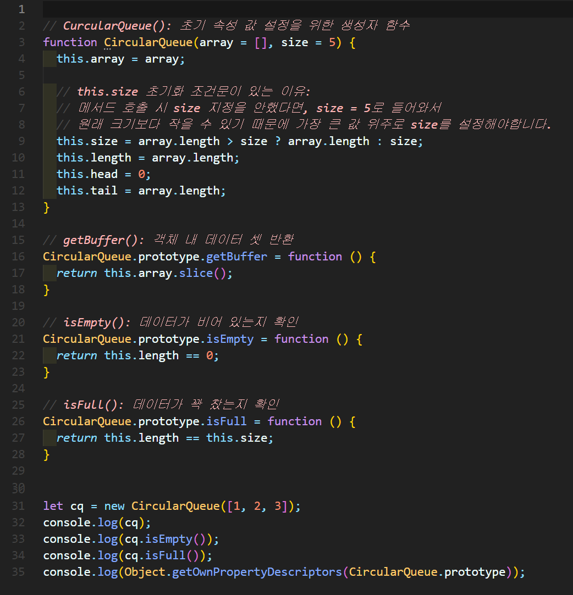
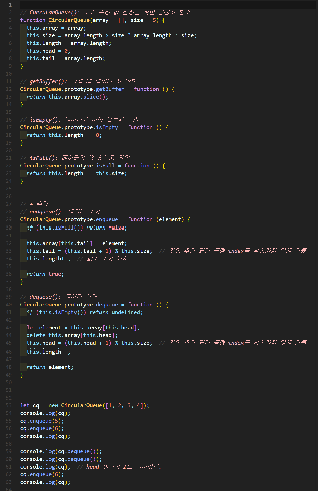
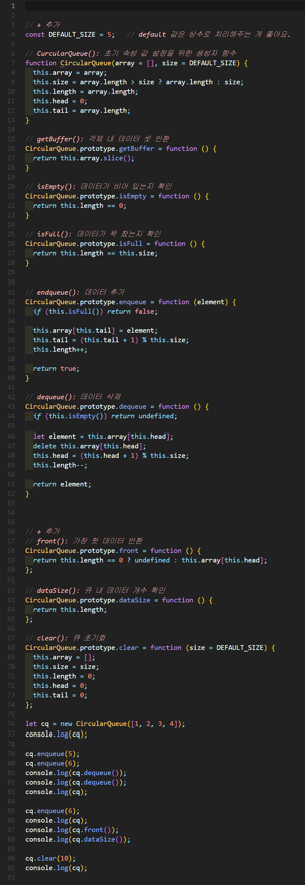

# 원형 큐(Circular queue)
원형 형태를 가지며 먼저 넣은 데이터가 먼저 나오는 **FIFO(First In First Out)** 기반의 선형 자료구조

4가지 Element를 갖습니다.
- head
- tail
- size
- length 




## 1. 원형 큐 구현


### 🧪 실행결과


``` javascript
CircularQueue {
  array: [ 1, 2, 3 ],
  size: 5,
  length: 3,
  head: 0,
  tail: 3
}
false
false
{
  constructor: {
    value: [Function: CircularQueue],
    writable: true,
    enumerable: false,
    configurable: true
  },
  getBuffer: {
    value: [Function (anonymous)],
    writable: true,
    enumerable: true,
    configurable: true
  },
  isEmpty: {
    value: [Function (anonymous)],
    writable: true,
    enumerable: true,
    configurable: true
  },
  isFull: {
    value: [Function (anonymous)],
    writable: true,
    enumerable: true,
    configurable: true
  }
}
```

## 2. 원형 큐 구현



### 🧪 실행결과

``` javascript
CircularQueue {
  array: [ 1, 2, 3, 4 ],
  size: 5,
  length: 4,
  head: 0,
  tail: 4
}
CircularQueue {
  array: [ 1, 2, 3, 4, 5 ],
  size: 5,
  length: 5,
  head: 0,
  tail: 0
}
1
2
CircularQueue {
  array: [ <2 empty items>, 3, 4, 5 ],
  size: 5,
  length: 3,
  head: 2,
  tail: 0
}
CircularQueue {
  array: [ 6, <1 empty item>, 3, 4, 5 ],
  size: 5,
  length: 4,
  head: 2,
  tail: 1
}        
```


## 3. 원형 큐 구현


### 🧪 실행결과


``` javascript
CircularQueue {
  array: [ 1, 2, 3, 4 ],
  size: 5,
  length: 4,
  head: 0,
  tail: 4
}
1
2
CircularQueue {
  array: [ <2 empty items>, 3, 4, 5 ],
  size: 5,
  length: 3,
  head: 2,
  tail: 0
}
CircularQueue {
  array: [ 6, <1 empty item>, 3, 4, 5 ],
  size: 5,
  length: 4,
  head: 2,
  tail: 1
}
3
4
CircularQueue { array: [], size: 10, length: 0, head: 0, tail: 0 }
```


