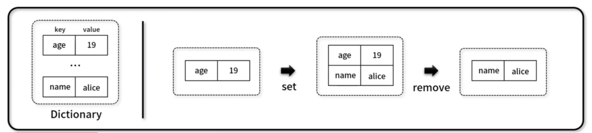
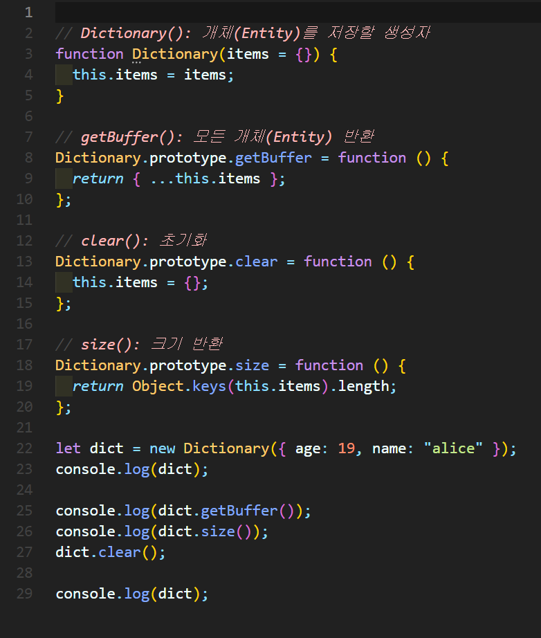
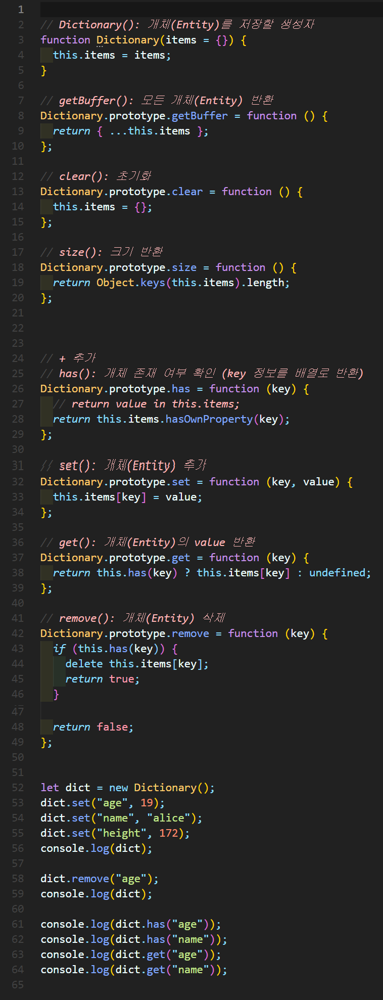
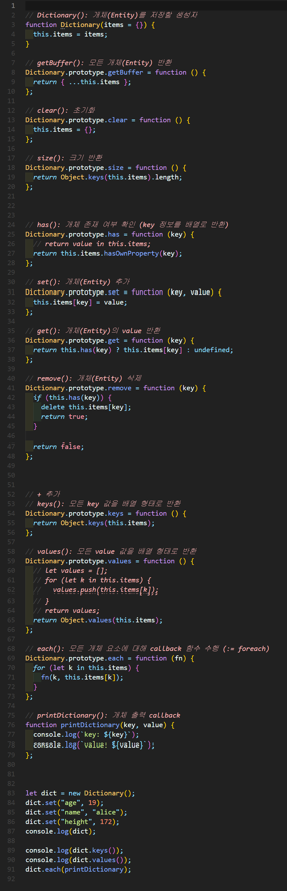

# 딕셔너리(Dictionary)
- key - value 형태로 다양한 자료형 개체(Entity)를 저장하는 자료구조 (≓ Map)




## 1. 딕셔너리 구현


### 🧪 실행결과


``` javascript
Dictionary { items: { age: 19, name: 'alice' } }
{ age: 19, name: 'alice' }
2
Dictionary { items: {} }
```

## 2. 딕셔너리 구현



### 🧪 실행결과

``` javascript
Dictionary { items: { age: 19, name: 'alice', height: 172 } }
Dictionary { items: { name: 'alice', height: 172 } }
false
true
undefined
alice          
```


## 3. 딕셔너리 구현


### 🧪 실행결과


``` javascript
Dictionary { items: { age: 19, name: 'alice', height: 172 } }
[ 'age', 'name', 'height' ]
[ 19, 'alice', 172 ]
key: age
value: 19
key: name
value: alice
key: height
value: 172
```


