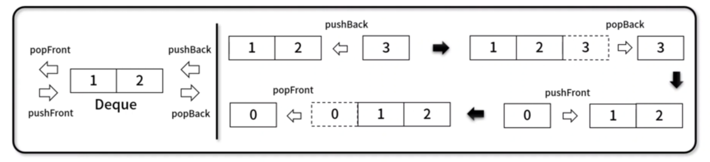
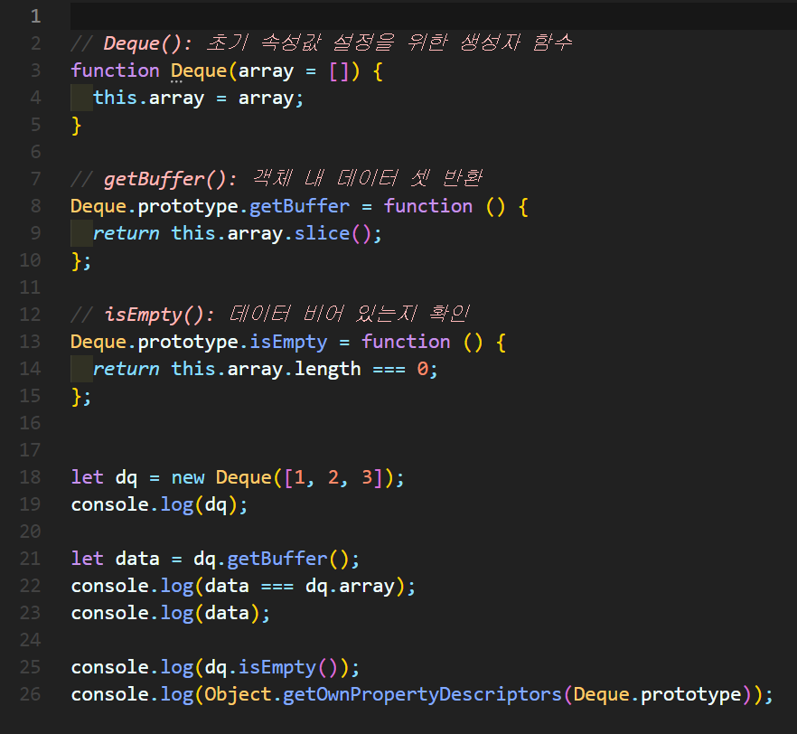
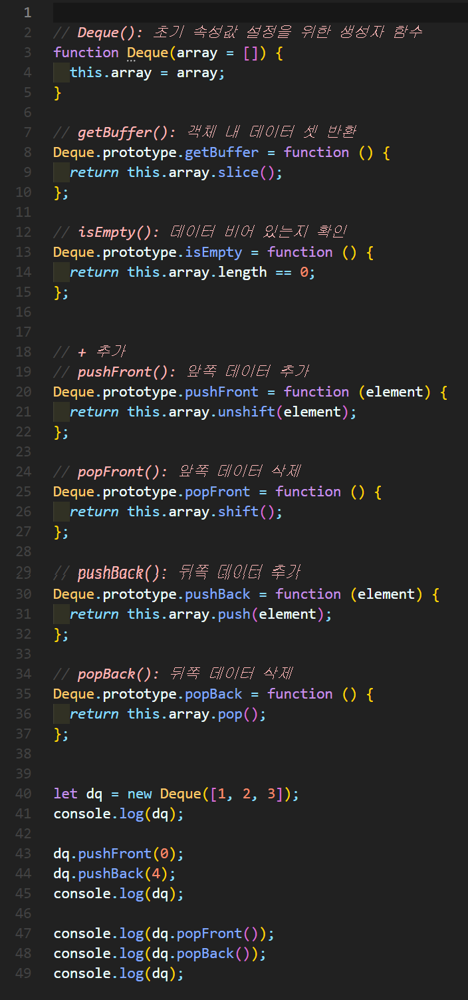
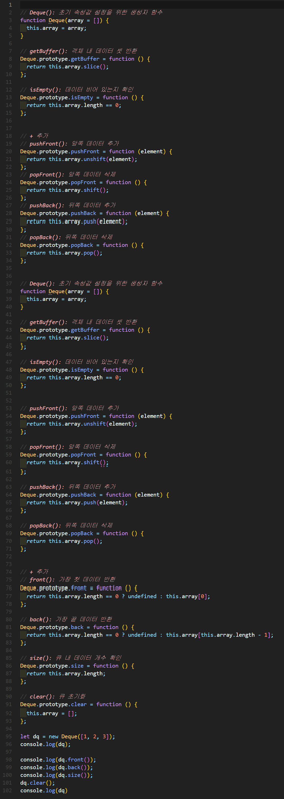

# 데크(Deque)
- Double-Ended Queue 약자로 삽입과 삭제가 양쪽 끝에서 모두 발생할 수 있는 선형 자료구조




## 1. 데크 구현


### 🧪 실행결과


``` javascript
Deque { array: [ 1, 2, 3 ] }
false
[ 1, 2, 3 ]
false
{
  constructor: {
    value: [Function: Deque],
    writable: true,
    enumerable: false,
    configurable: true
  },
  getBuffer: {
    value: [Function (anonymous)],
    writable: true,
    enumerable: true,
    configurable: true
  },
  isEmpty: {
    value: [Function (anonymous)],
    writable: true,
    enumerable: true,
    configurable: true
  }
}
```

## 2. 데크 구현



### 🧪 실행결과

``` javascript
Deque { array: [ 1, 2, 3 ] }
Deque { array: [ 0, 1, 2, 3, 4 ] }
0
4
Deque { array: [ 1, 2, 3 ] }             
```


## 3. 데크 구현


### 🧪 실행결과


``` javascript
Deque { array: [ 1, 2, 3 ] }
1
3
3
Deque { array: [] }
```


