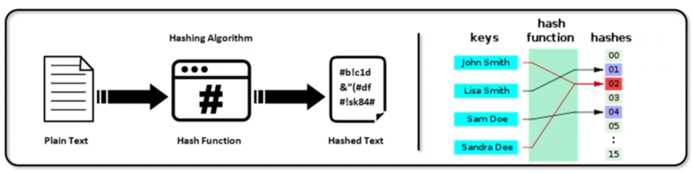
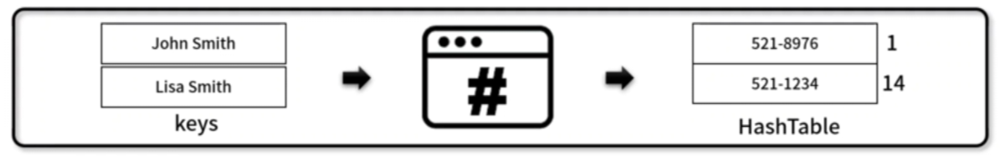
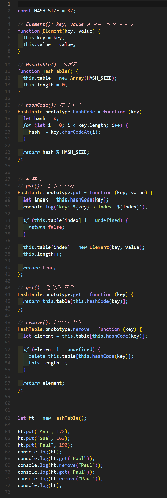
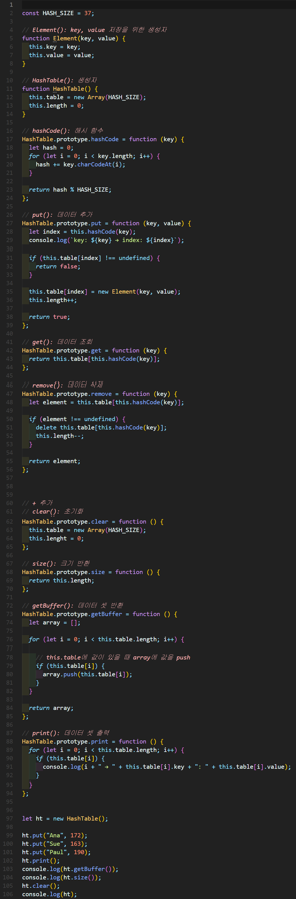

# 해시 테이블(Hash table)

## 해시 함수
- 임의의 길이 데이터를 **고정된 길이의 데이터로 매핑**하는 
함수
- 해시 함수 특성
  - 압축성: 다양한 가변 길이의 입력에 대해 고정된 크기의 결과값을 반환하는 성질
  - 효율성: 어떤 입력 값에 대해서도 많은 자원과 시간이 소요되지 않고 처리되는 성질
  - **저항성:** 결과값을 바탕으s로 입력 값을 찾는 것이 불가능한 성질
- 예시) 사용자가 비밀번호 입력 > 해시함수로 반환 > DB에 저장
        초기 패스워드(hashed), 입력 패스워드(hashed) 동일한지 확인하는 방식



## 해시테이블
- Hash 함수를 사용하여 평균 O(1) 시간 복잡도로 특정 값을 신속하게 찾는 자료구조
- for문에서 찾게되면 O(n) 시간 복잡도를 갖는데 비해 그림 예시처럼 521-8976의 index = 1이면 바로 찾는 게 가능해서 O(1) 시간 복잡도를 갖게됩니다. 
- 속도 최적화 부분에서 많이 사용하는 자료구조
- 충돌(Collisiion) 해결 방법
 - 해시 함수 변경: 더 큰 숫자의 공간과 Modular 산술 값을 이용해 충돌 최소화
 - 자료 구조 확장: Open Addressing Method(선형 조사법, 이중해시), Closs Addressing Method(체이닝)




## 1. 해시 테이블 구현


### 🧪 실행결과


``` javascript

```

## 2. 해시 테이블 구현



### 🧪 실행결과

``` javascript
       
```


## 3. 해시 테이블 구현


### 🧪 실행결과


``` javascript

```


