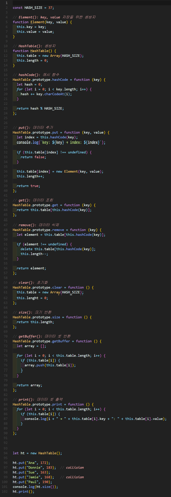
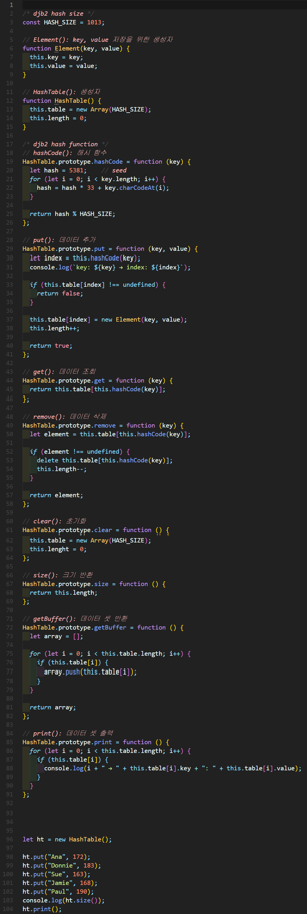

# 해시 테이블(Hash table)

## 해시 함수
- 임의의 길이 데이터를 **고정된 길이의 데이터로 매핑**하는 
함수
- 해시 함수 특성
  - 압축성: 다양한 가변 길이의 입력에 대해 고정된 크기의 결과값을 반환하는 성질
  - 효율성: 어떤 입력 값에 대해서도 많은 자원과 시간이 소요되지 않고 처리되는 성질
  - **저항성:** 결과값을 바탕으s로 입력 값을 찾는 것이 불가능한 성질
- 예시) 사용자가 비밀번호 입력 > 해시함수로 반환 > DB에 저장
        초기 패스워드(hashed), 입력 패스워드(hashed) 동일한지 확인하는 방식


## 해시 테이블
- Hash 함수를 사용하여 평균 O(1) 시간 복잡도로 특정 값을 신속하게 찾는 자료구조
- for문에서 찾게되면 O(n) 시간 복잡도를 갖는데 비해 그림 예시 521-8976의 index = 1 인덱스가 있으면 찾는 게 바로 가능해 **O(1)** 시간 복잡도를 갖게 됩니다. 
- 속도 최적화 부분에서 많이 사용하는 자료구조
- 충돌(Collisiion) 해결 방법
 - 해시 함수 변경: 더 큰 숫자의 공간과 Modular 산술 값을 이용해 충돌 최소화
 - 자료 구조 확장: Open Addressing Method(선형 조사법, 이중해시), Closs Addressing Method(체이닝)


## 1. 해시 테이블 구현


### 🧪 실행결과


``` javascript
HashTable { table: [ <37 empty items> ], length: 0 }
13
5
32
```

## 2. 해시 테이블 구현


### 🧪 실행결과

``` javascript
key: Ana → index: 13
key: Sue → index: 5
key: Paul → index: 32
HashTable {
  table: [
    <5 empty items>,
    Element { key: 'Sue', value: 163 },
    <7 empty items>,
    Element { key: 'Ana', value: 172 },
    <18 empty items>,
    Element { key: 'Paul', value: 190 },
    <4 empty items>
  ],
  length: 3
}
Element { key: 'Paul', value: 190 }
Element { key: 'Paul', value: 190 }
undefined
undefined
HashTable {
  table: [
    <5 empty items>,
    Element { key: 'Sue', value: 163 },
    <7 empty items>,
    Element { key: 'Ana', value: 172 },
    <23 empty items>
  ],
  length: 2
}       
```


## 3. 해시 테이블 구현


### 🧪 실행결과


``` javascript
key: Ana → index: 13
key: Sue → index: 5
key: Paul → index: 32
5 → Sue: 163
13 → Ana: 172
32 → Paul: 190
[
  Element { key: 'Sue', value: 163 },
  Element { key: 'Ana', value: 172 },
  Element { key: 'Paul', value: 190 }
]
3
HashTable { table: [ <37 empty items> ], length: 3, lenght: 0 }
```


## 4. 해시 테이블 충돌 문제(use loselose) 


### 🧪 실행결과


``` javascript
key: Ana → index: 13
key: Donnie → index: 13
key: Sue → index: 5
key: Jamie → index: 5
key: Paul → index: 32
3
5 → Sue: 163
13 → Ana: 172
32 → Paul: 190
```

index: 13 과 index: 5가 충돌


## 5. 해시 테이블 충돌 해결(use djb2) 


### 🧪 실행결과


``` javascript
key: Donnie → index: 278
key: Sue → index: 502   
key: Jamie → index: 962
key: Paul → index: 54
5
54 → Paul: 190
278 → Donnie: 183
502 → Sue: 163
925 → Ana: 172
962 → Jamie: 168
```


