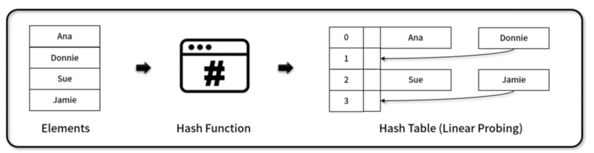
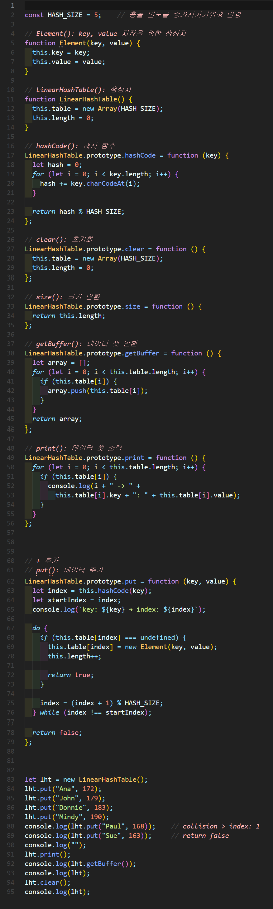
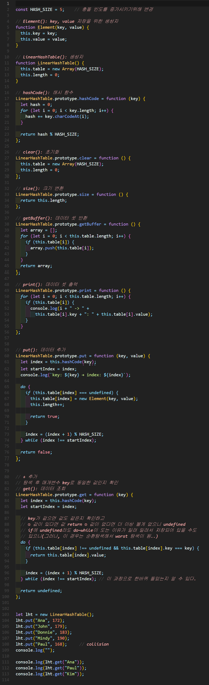

# 선형 조사법 선형 조사법 해시 테이블(Linear probing hash table)

- Hash 충돌이 발생했을 때, **그 다음 주소를 확인하고 비어 있다면 그 자리에 대신 저장**하는 해시테이블 기반 자료구조




## 1. 선형 조사법 해시 테이블 구현


### 🧪 실행결과


``` javascript
LinearHashTable { table: [ <5 empty items> ], length: 0 }
```

## 2. 선형 조사법 해시 테이블 구현



### 🧪 실행결과

``` javascript
key: Ana → index: 2
key: John → index: 4
key: Donnie → index: 0
key: Mindy → index: 3
key: Paul → index: 2
true
key: Sue → index: 1
false

0 -> Donnie: 183
1 -> Paul: 168
2 -> Ana: 172
3 -> Mindy: 190
4 -> John: 179
[
  Element { key: 'Donnie', value: 183 },
  Element { key: 'Paul', value: 168 },
  Element { key: 'Ana', value: 172 },
  Element { key: 'Mindy', value: 190 },
  Element { key: 'John', value: 179 }
    Element { key: 'Ana', value: 172 },
    Element { key: 'John', value: 179 }
  length: 5
LinearHashTable { table: [ <5 empty items> ], length: 0 }
```


## 3. 선형 조사법 해시 테이블 구현


### 🧪 실행결과


``` javascript
key: Ana → index: 2
key: John → index: 4
key: Donnie → index: 0
key: Mindy → index: 3
key: Paul → index: 2

172
168
undefined
```


## 4. 선형 조사법 해시 테이블 구현


### 🧪 실행결과


``` javascript
key: Ana → index: 2
key: John → index: 4
key: Donnie → index: 0
key: Mindy → index: 3
key: Paul → index: 2

Element { key: 'Ana', value: 172 }
168
Element { key: 'Paul', value: 168 }
undefined
undefined
3

0 -> Donnie: 183
3 -> Mindy: 190
4 -> John: 179
LinearHashTable {
  table: [
    Element { key: 'Donnie', value: 183 },
    <2 empty items>,
    Element { key: 'Mindy', value: 190 },
    Element { key: 'John', value: 179 }
  ],
  length: 3
}
```
