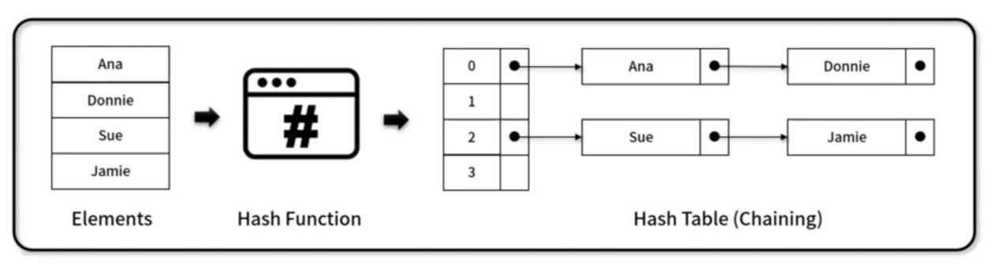
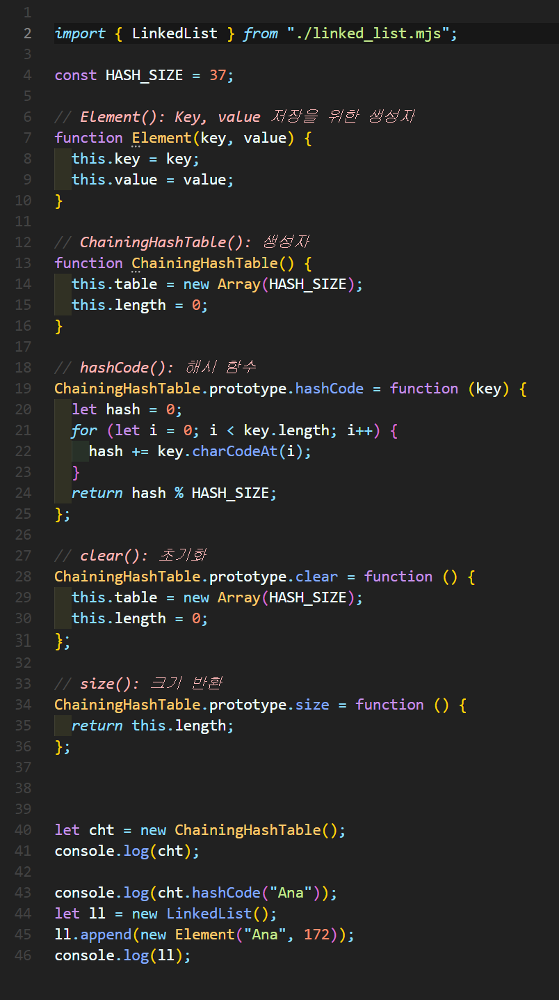
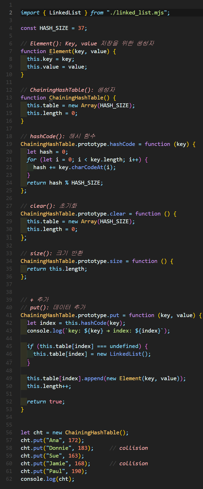
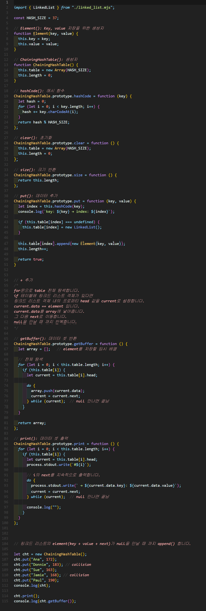
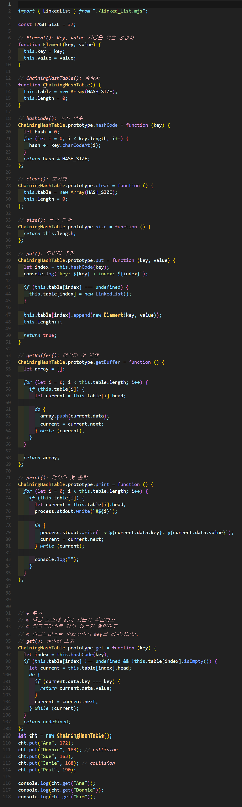
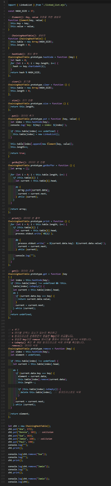

# 체이닝 해시 테이블(Chaining Hash table)
- **별도의 자료구조인 연결 리스트를 병합 사용**하여 Hash 충돌을 해결한 해시테이블 기반 자료구조
- 해당 연결리스트만 탐색하면 돼서 기존 해시테이블보다 시간이 단축됩니다.




## 1. 체이닝 해시 테이블 구현


### 🧪 실행결과


``` javascript
ChainingHashTable { table: [ <37 empty items> ], length: 0 }
13
LinkedList {
  head: Node { data: Element { key: 'Ana', value: 172 }, next: null },
  length: 1
}
```

## 2. 체이닝 해시 테이블 구현



### 🧪 실행결과

``` javascript
key: Ana → index: 13
key: Donnie → index: 13
key: Sue → index: 5
key: Jamie → index: 5
key: Paul → index: 32
ChainingHashTable {
  table: [
    <5 empty items>,
    LinkedList { head: [Node], length: 2 },
    <7 empty items>,
    LinkedList { head: [Node], length: 2 },
    <18 empty items>,
    LinkedList { head: [Node], length: 1 },
    <4 empty items>
  ],
  length: 5
}key: Ana → index: 13
key: Donnie → index: 13
key: Sue → index: 5
key: Jamie → index: 5
key: Paul → index: 32
ChainingHashTable {
  table: [
    <5 empty items>,
    LinkedList { head: [Node], length: 2 },
    <7 empty items>,
    LinkedList { head: [Node], length: 2 },
    <18 empty items>,
    LinkedList { head: [Node], length: 1 },
    <4 empty items>
  ],
  length: 5
}
```


## 3. 체이닝 해시 테이블 구현


### 🧪 실행결과


``` javascript
key: Ana → index: 13
key: Donnie → index: 13
key: Sue → index: 5
key: Jamie → index: 5
key: Paul → index: 32
ChainingHashTable {
  table: [
    <5 empty items>,
    LinkedList { head: [Node], length: 2 },
    <7 empty items>,
    LinkedList { head: [Node], length: 2 },
    <18 empty items>,
    LinkedList { head: [Node], length: 1 },
    <4 empty items>
  ],
  length: 5
}
#5 → Sue: 163 → Jamie: 168
#13 → Ana: 172 → Donnie: 183
#32 → Paul: 190
[
  Element { key: 'Sue', value: 163 },
  Element { key: 'Jamie', value: 168 },
  Element { key: 'Ana', value: 172 },
  Element { key: 'Donnie', value: 183 },
  Element { key: 'Paul', value: 190 }
]
```


## 4. 체이닝 해시 테이블 구현


### 🧪 실행결과


``` javascript
key: Ana → index: 13
key: Donnie → index: 13
key: Sue → index: 5
key: Jamie → index: 5
key: Paul → index: 32
172
183
undefined
```


## 5. 체이닝 해시 테이블 구현


### 🧪 실행결과


``` javascript
key: Ana → index: 13
key: Donnie → index: 13   
key: Sue → index: 5       
key: Jamie → index: 5     
key: Paul → index: 32     

#5 → Sue: 163 → Jamie: 168
#13 → Ana: 172 → Donnie: 183
#32 → Paul: 190
Element { key: 'Sue', value: 163 }

#5 → Jamie: 168
#13 → Ana: 172 → Donnie: 183
#32 → Paul: 190
Element { key: 'Jamie', value: 168 }

#13 → Ana: 172 → Donnie: 183
#32 → Paul: 190
undefined
ChainingHashTable {
  table: [
    <13 empty items>,
    LinkedList { head: [Node], length: 2 },
    <18 empty items>,
    LinkedList { head: [Node], length: 1 },
    <4 empty items>
  ],
  length: 3
}
```
