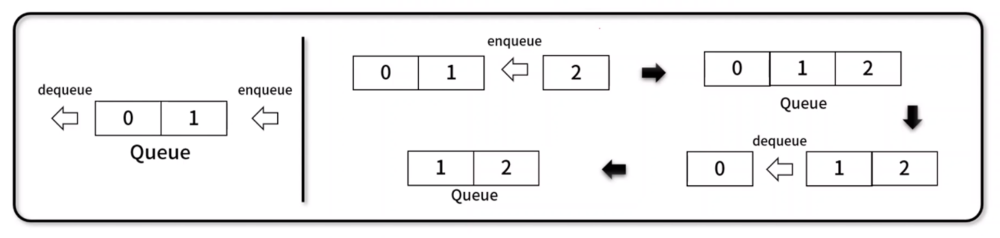
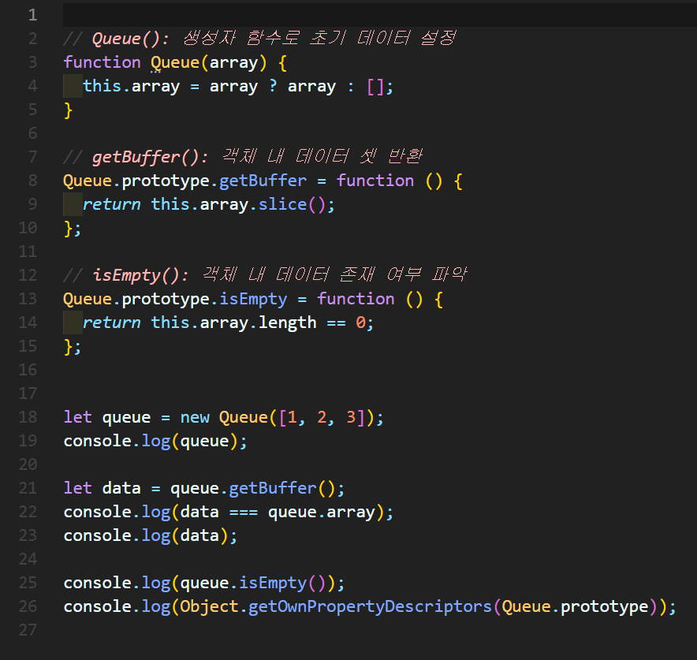
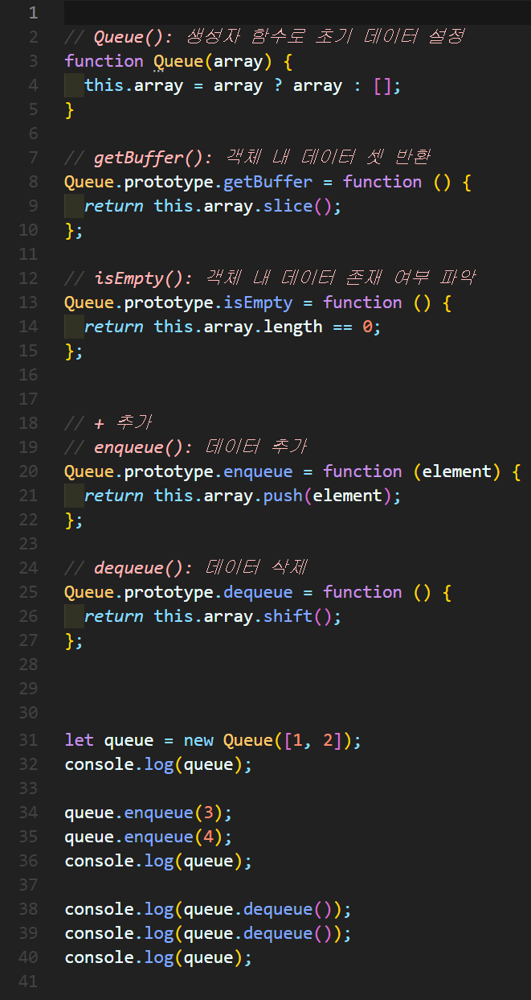
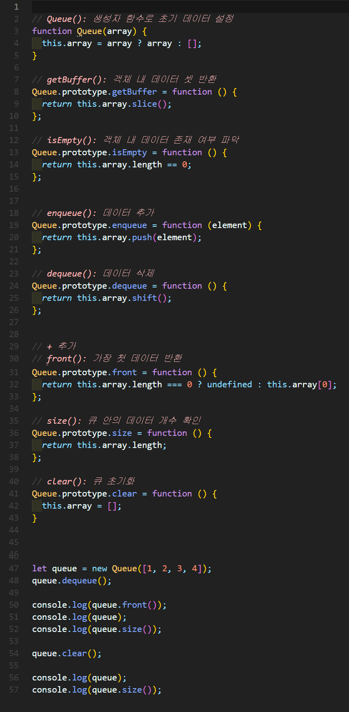
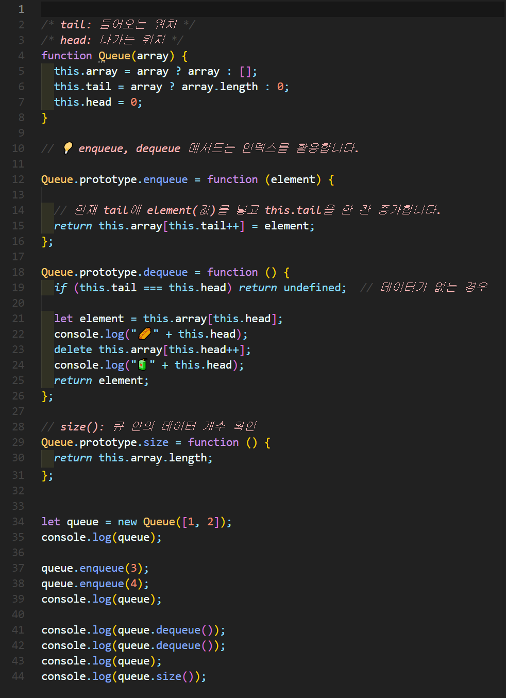
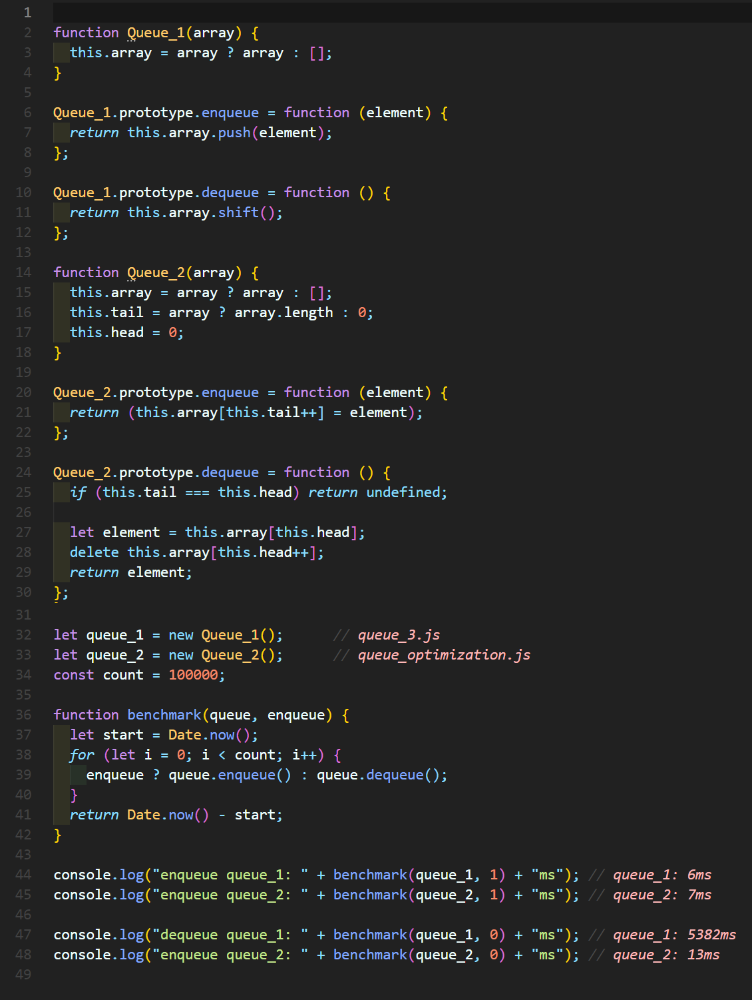

# 큐(Queue)
나중에 넣은 데이터가 먼저 나오는 **FIFO(First In First Out)** 기반의 선형 자료 구조

- 예시) 시간 순서로 먼저 들어온게 먼저 처리됩니다.




## 1. 큐 구현


### 🧪 실행결과


``` javascript
Queue { array: [ 1, 2, 3 ] }
false
[ 1, 2, 3 ]
false
{
  constructor: {
    value: [Function: Queue],
    writable: true,
    enumerable: false,
    configurable: true
  },
  getBuffer: {
    value: [Function (anonymous)],
    writable: true,
    enumerable: true,
    configurable: true
  },
  isEmpty: {
    value: [Function (anonymous)],
    writable: true,
    enumerable: true,
    configurable: true
  }
}
```

## 2. 큐 구현



### 🧪 실행결과

``` javascript
Queue { array: [ 1, 2 ] }
Queue { array: [ 1, 2, 3, 4 ] }
1
2
Queue { array: [ 3, 4 ] }
```


## 3. 큐 구현


### 🧪 실행결과


``` javascript
2
Queue { array: [ 2, 3, 4 ] }
3
Queue { array: [] }
0
```


## 4. 큐 최적화 구현

- 방식 개선: enqueue / dequeue 방식을 push / shift에서 index로 변경 → shift()를 사용할 경우 O(n) 시간이 걸리기 때문에 index를 이용해 O(1)로 시간 단축합니다.


### 🧪 실행결과


``` javascript
Queue { array: [ 1, 2 ], tail: 2, head: 0 }
Queue { array: [ 1, 2, 3, 4 ], tail: 4, head: 0 }
🌭0
🧃1
1
🌭1
🧃2
2
Queue { array: [ <2 empty items>, 3, 4 ], tail: 4, head: 2 }    
4
```


## 5. Benchmark


### 🧪 실행결과


``` javascript
enqueue queue_1: 6ms
enqueue queue_2: 7ms
dequeue queue_1: 5382ms
enqueue queue_2: 13ms
```


